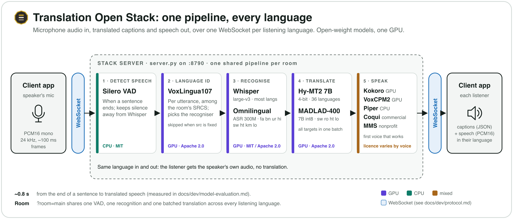

# Translation Open Stack

**Speech in, translated speech out, in 25 languages, from open-weight models on
one GPU you control.** A WebSocket server: a client streams microphone audio in
and gets back captions and spoken translation for every language its listeners
need. One pipeline serves every language (voice detection, language ID,
recognition, one batched translation, a voice per language), so the GPU bill
doesn't grow with the number of languages, and no audio leaves the machine. It
is the "Local stack" provider for Lithos Live Translation and Lithos Talk, and
any client that speaks [the protocol](docs/dev/protocol.md) can use it.



> **Licences.** This repository's code is [Apache 2.0](LICENSE). The models it
> downloads are **not** covered by that licence: each keeps its own, and some
> are **non-commercial**. Read [docs/licences.md](docs/licences.md) before you
> deploy it commercially.

## Three ways to run it

Same code, same models, same protocol; what differs is where the GPU is and
who starts it.

1. **Your own GPU, with Docker.** A 48 GB NVIDIA card (32 GB with a smaller
   translator), Linux or Windows WSL2, Docker with the NVIDIA Container
   Toolkit. No per-hour bill, and audio never leaves your network.
2. **Your own machine, without Docker.** NVIDIA or AMD (ROCm) on Linux, in a
   Python virtualenv: for AMD cards, two smaller GPUs, or a machine where you'd
   rather not run Docker. Steps:
   [user guide](docs/user-guide.md#install-without-docker-linux-nvidia-or-amd).
3. **Your own RunPod pod.** Rent a 48 GB GPU by the hour: one click on
   **[Deploy on RunPod](https://console.runpod.io/deploy?template=dftcc24b6q)**
   (the prebuilt image `ghcr.io/lithsec/translation-open-stack`), then connect to
   `wss://<pod-id>-8790.proxy.runpod.net` with the access key the pod prints in
   its log. The pod stops itself when idle. Steps:
   [user guide](docs/user-guide.md#one-click-the-runpod-template).


## Quick start (Docker)

```bash
git clone https://github.com/lithsec/translation-open-stack.git && cd translation-open-stack
cp .env.example .env            # set STACK_TOKEN (openssl rand -hex 32); LANGS, EDITION if needed
docker compose up -d --build    # first start: 30-60 min to download and build the models
docker compose logs -f          # ready at "[stack] ready on :8790"
curl http://localhost:8790/health
```

Then point your app at `ws://<gpu-box-ip>:8790` with the token as its access
key. The token is the only lock: never expose port 8790 to the internet
without one, and use TLS beyond your LAN. Requirements, RunPod, and every
step in between: the [user guide](docs/user-guide.md).

## Where next

| To | Read |
|---|---|
| Install, run on RunPod, connect apps, pick languages, swap voices and models, size GPUs, troubleshoot | [docs/user-guide.md](docs/user-guide.md) |
| Look up an environment variable, a `languages.toml` key, a command, a pin, or a close code | [docs/reference.md](docs/reference.md) |
| Check what each model and voice's licence allows, and what `EDITION=commercial` changes | [docs/licences.md](docs/licences.md) |
| Write a client | [docs/dev/protocol.md](docs/dev/protocol.md) |
| Understand the server, or add a recogniser, translator or voice | [docs/dev/architecture.md](docs/dev/architecture.md), [docs/dev/adding-an-engine.md](docs/dev/adding-an-engine.md) |
| See what was tested, what won, and why | [docs/dev/model-evaluation.md](docs/dev/model-evaluation.md) (raw data in [eval/](eval/README.md)) |
| Learn from what broke | [docs/dev/lessons-learned.md](docs/dev/lessons-learned.md) |

## Licence

Copyright 2026 Vortas, LLC. Licensed under the [Apache License, Version 2.0](LICENSE);
see [NOTICE](NOTICE). This code was developed for Lithos Live Translation (translate.lithos.community), extracted into this one, and is published here under Apache 2.0 by
its copyright holder.

The third-party models, voices and libraries it downloads are under their own
licences, and some are non-commercial (Meta's MMS-TTS and several Piper
voices). `EDITION=commercial` loads only what is classified as commercially
usable, enforced by code; `python3 server/stack_config.py check --edition
commercial` shows what you would get. Every component, its licence and
source, and the checklist before commercial use:
[docs/licences.md](docs/licences.md). Not legal advice.
