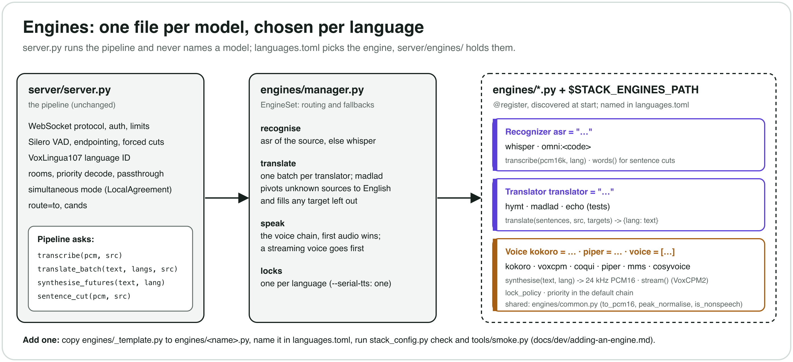

# Architecture

How the server is put together. What each stage does and why is in the
[reference, "The models, stage by stage"](../reference.md#the-models-stage-by-stage)
and [lessons-learned.md](lessons-learned.md); the wire protocol in
[protocol.md](protocol.md); how to add a model in
[adding-an-engine.md](adding-an-engine.md).

The pipeline is one process (`server/server.py`) that serves every language:
speech detection, language ID, recognition once per utterance, one batched
translation for every listening language, and a voice per language. Since
2026-09-29 the models behind recognition, translation and voices are
**engines**, one file each, chosen per language in `languages.toml`:

## Module map

| File | What it holds |
|---|---|
| `server/server.py` | The pipeline and the protocol: WebSocket handling, auth and limits (with `stack_auth.py`), Silero VAD and endpointing, forced cuts, VoxLingua107 language ID, rooms (shared VAD/ASR/MT, priority decode, passthrough, primary promotion), simultaneous mode (LocalAgreement, trimming), solo connections (`route=to`, `cands`), warm-up, `/health`, flags. `Pipeline` owns the VAD and language ID, and an `EngineSet` for everything else. |
| `server/stack_config.py` | Reads and validates `languages.toml` (language tables and `[models]`) against the registered engines; `check`, `engines`, `get`, `piper` for scripts. |
| `server/engines/__init__.py` | The registry: `@register`, discovery of `engines/*.py` and `STACK_ENGINES_PATH`. |
| `server/engines/base.py` | The interfaces (`Recognizer`, `Translator`, `Voice`), `Context`, `AudioStream`, the audio rates. |
| `server/engines/manager.py` | `EngineSet`: loads the enabled engines in order, routes each language to its engine with the fallbacks, runs the voice chain, holds the per-language voice locks. |
| `server/engines/common.py` | Shared helpers: `to_pcm16` (resample, pad, ramp), `peak_normalise`, sentence splitting and joining, the non-speech filter (`is_nonspeech`, `content_units`, `SHORT_NOISE_*`), `hf_snapshot`. |
| `server/engines/whisper.py` | faster-whisper, English and multilingual slots, the segment gates, word timings for sentence cuts. |
| `server/engines/omnilingual.py` | Omnilingual ASR (`asr = "omni:<code>"`). |
| `server/engines/hymt.py` | Hy-MT2 7B 4-bit (`HYMT_NAMES`, the prompt, its lock). |
| `server/engines/madlad.py` | MADLAD-400 through CTranslate2 or transformers: the fallback translator and the English pivot (`MT_BEAM`). |
| `server/engines/kokoro.py`, `voxcpm.py`, `coqui.py`, `piper.py`, `mms.py`, `cosyvoice.py` | The voices. `voxcpm.py` is an HTTP client of `server/voxcpm_service.py`, which runs the model in its own virtualenv. |
| `server/engines/echo.py` | A test translator (source text back). |
| `server/engines/_template.py` | A copy-me example engine (not loaded). |
| `server/voxcpm_service.py` | The VoxCPM2 service: reference-voice cloning, stateful 48→24 kHz resampling, streaming gain and soft limiter. |

## Per-utterance flow

1. Audio arrives (24 kHz PCM16), is resampled to 16 kHz and fed to the
   connection's or room's own Silero copy (`Pipeline.new_vad`).
2. An endpoint (or a forced cut, placed with the recogniser's word timings by
   `Pipeline.sentence_cut`) closes an utterance.
3. With `src=auto`, `Pipeline.identify_conf` picks the source language among
   `--srcs` (or `cands`).
4. `Pipeline.transcribe` → `EngineSet.recognizer_for(src)` → that engine's
   `transcribe`.
5. `Pipeline.translate_batch` → `EngineSet.translate_batch`: targets grouped by
   translator, one batch each, MADLAD for the pivot and the gaps. A room's
   `priority` language gets its own call first.
6. `Pipeline.synthesise_futures` → `EngineSet.synthesise_futures`: one pool task
   per sentence through the language's voice chain (or one lazy stream per
   sentence for a streaming voice), sent in order as each is ready.

Steps 1-3 and the choreography around 4-6 (rooms, passthrough, streaming
commits) do not depend on which engines run.

## Design choices

- **Explicit discovery, no entry points.** Every non-underscore module in
  `server/engines/` is imported in name order, then each `STACK_ENGINES_PATH`
  directory. A new in-tree engine is one new file; an out-of-tree one is one
  file plus one environment variable. `stack_config.py engines` lists what was
  found and from which file, so there is no guessing what is loaded.
- **Names are configuration.** `languages.toml` already named models per
  language (`asr`, `translator`, the voice keys); those keys now accept any
  registered name, and a voice's per-language value lives under its own name
  exactly as `piper = "..."` always did. The one new key is `voice = [...]`,
  for choosing the chain order. The shipped file did not change.
- **Built-ins still follow the flags.** `scripts/run.sh` decides what a
  deployment runs (`--kokoro`, `--hymt DIR`, `--omni`, `--mms`/`--coqui` by
  edition); a new engine loads when a served language names it.
- **Fallbacks are fixed.** Whisper and MADLAD always load and always catch
  whatever another engine can't serve, as they did before; nothing else is
  special-cased by name except Hy-MT2 being the default translator.
- **The routing is tested against the old code.** `tests/test_engines.py`
  keeps a copy of the pre-refactor `translate_batch` and voice chain and
  compares them with `EngineSet` over many language sets, sources, failures and
  texts, including which MADLAD decodes run, in which batches.
- **Import must be cheap.** `stack_config.py` imports the engines to validate
  names on machines without torch, so every heavy import happens in `load()`.
