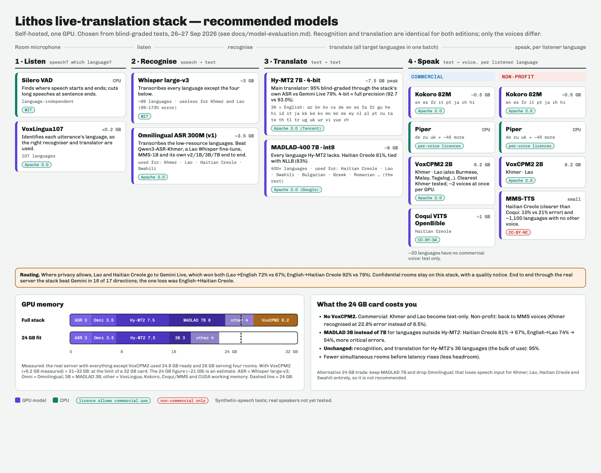

# Choosing the models: what we tested, what won, and why

*Translation Open Stack · evaluation of 26–27 September 2026*

> **In one paragraph.** We tested 20+ open models and two cloud services
> (Gemini Live on Vertex AI, Azure Speech) on the same sentences and the same
> audio, graded blind. The stack we recommend (Whisper and Omnilingual to listen,
> **Hy-MT2 7B** to translate, Kokoro, Piper and VoxCPM2 to speak) beat Gemini Live
> end to end in **16 of 17** directions, scoring **92% against Gemini's 80%**. It
> answers about **0.8 s after the speaker stops**, and no audio leaves the
> server. Gemini is still better for **Lao** and **Haitian Creole**, the
> low-resource languages outside Hy-MT2. Google's TranslateGemma 12B came close
> (92% against Hy-MT2's 94%) and is the best single all-rounder, but it is much
> weaker in Khmer. Every test used synthetic speech; the most important test
> still to run is with real speakers.

---

## Contents

1. [Recommendation](#1-recommendation)
2. [How we tested](#2-how-we-tested)
3. [Results by stage](#3-results-by-stage)
4. [Every model we tried](#4-every-model-we-tried)
5. [Fitting on a 24 GB card](#5-fitting-on-a-24-gb-card)
6. [Limits of this evaluation](#6-limits-of-this-evaluation)
7. [Reproducing it](#7-reproducing-it)

---

## 1. Recommendation

Listening and translating are the same in both editions. Only the voices differ,
because the best voices for two languages carry non-commercial licences.

| Stage | Model | Used for | Licence |
|---|---|---|---|
| Detect speech | Silero VAD | all | MIT |
| Detect language | VoxLingua107 | all (107 languages) | Apache 2.0 |
| Recognise | Whisper large-v3 | everything except the four below | MIT |
| Recognise | **Omnilingual ASR 300M (v1)** | Khmer, Lao, Haitian Creole, Swahili | Apache 2.0 |
| Translate | **Hy-MT2 7B, 4-bit** | its 36 languages + English | Apache 2.0 |
| Translate | **MADLAD-400 7B, int8** | everything else (Haitian Creole, Lao…) | Apache 2.0 |
| Speak | Kokoro 82M | en es fr it pt ja zh hi | Apache 2.0 |
| Speak | Piper | de ru uk and ~45 more | per voice: see [licences.md](../licences.md) |
| Speak | **VoxCPM2 2B** | Khmer, Lao | Apache 2.0 |
| Speak, *commercial* | Coqui VITS (OpenBible) | Haitian Creole | CC-BY-SA |
| Speak, *non-profit* | **MMS-TTS** | Haitian Creole + ~1,100 languages with no other voice | **CC-BY-NC** |

**Routing.** Where privacy allows, send Lao and Haitian Creole to Gemini Live,
which won both. Confidential rooms stay on the stack and show a quality notice.

**In reserve: TranslateGemma 12B.** It could replace *both* translators with
one model: 92% in the major languages, 77% in Haitian Creole. That makes it the
better choice for a deployment that doesn't need Khmer or Lao. It lost clearly
in Khmer (67% against Hy-MT2's 94%) and speaking Lao (56%), which is why it
isn't the default.

**What the non-profit edition gains.** Meta's non-commercial MMS voices let it
*speak* roughly 20 more languages that the commercial edition can only show as
text (Amharic, Burmese, Sinhala…), and give a clearer Haitian Creole voice.

---

## 2. How we tested

Every comparison used the same inputs for every system and a blind grader. The
choices below come from mistakes we made along the way.

### The test set

- **24 English sentences** written to catch the errors that matter in real use:
  directions, dosages ("two tablets every eight hours, no more than six a
  day"), times ("a quarter to twelve"), money ("$1,250 a month"), dates, phone
  numbers, negation ("I *don't* want the chicken") and who-did-what.
- **Native versions** of the same 24 sentences in each language, written by
  Gemini 2.5 Pro as a native speaker would say them, to test translation *into*
  English.
  - One lesson here: the first "Ukrainian" set came back in broken English, so
    Ukrainian→English results are excluded throughout.
  - Every source set is now checked for the right script before use.
- **Languages:** Spanish, French, German, Portuguese, Russian, Ukrainian,
  Mandarin, Japanese, Khmer, Haitian Creole and Lao, in both directions.

### The audio

- **Synthetic speech.** The native voices built into macOS for most languages;
  VoxCPM2 and Meta's MMS where macOS has none (Khmer, Lao, Haitian Creole).
- **Long speeches.** A 78-second reading with every pause removed, to exercise
  the cut when nobody breathes.
- **Same audio for everyone.** Gemini Live and the stack heard identical files.
  The first round wasn't fair: the text models got perfect typed text while
  Gemini had to listen. We repeated it with the stack listening too.

### Four kinds of measurement

| What | How |
|---|---|
| **Translation quality** | Gemini 2.5 Pro grades each sentence 0–3 (3 = correct and natural, 0 = wrong or missing), blind: systems are shuffled and labelled A, B, C… A sentence is flagged **critical** when a number, time, dose, amount, negation or person is wrong. The reported score is points ÷ maximum. |
| **Recognition accuracy** | Character error rate (CER) against the known text, after removing punctuation and spacing differences. |
| **Voice clarity** | Round trip: a recogniser transcribes each voice's output, and we measure the CER. Lower means easier to understand. It says nothing about naturalness; for that, listen to the samples. |
| **Speed and memory** | Timed on the real server: time to first audio, per-stage timings, GPU memory peaks, and how many voices one GPU sustains. |

### Hardware

A RunPod **RTX PRO 4500 Blackwell (32 GB)**, secure cloud. All the rounds
together took about 14 hours of GPU time, plus some Vertex AI usage.

---

## 3. Results by stage

### 3.1 End to end: the real server against Gemini Live

The same audio, with the stack's own recognition, graded blind; 17 valid
directions.

| | Stack (recommended) | Gemini Live |
|---|---|---|
| Score | **92%** | 80% |
| Directions won | **16 of 17** | 1 (English→Haitian Creole) |
| First translated audio | **~0.8 s after the speaker stops** | ~2.8 s after the speaker *starts*; speaks mid-sentence |
| Where audio goes | this server only | Google Cloud |

Gemini's losses were mostly **mishearings**, not mistranslations: "chicken"
became "children", "pain" became "bus", and "a quarter to twelve" became 5:15.
It also paraphrases while interpreting.

### 3.2 Translation

Blind-graded on perfect text, 19 directions (Ukrainian→English excluded).

| Model | All except Haitian Creole | Critical errors | Haitian Creole only |
|---|---|---|---|
| **Hy-MT2 7B** | **94.6%** | **12** | 18.8% (unsupported) |
| MADLAD-400 7B | 84.8% | 16 | **80.6%** |
| NLLB-200 3.3B | 84.1% | 26 | **82.6%** |
| MADLAD-400 3B (previous default) | 79.9% | 26 | 66.7% |

**Through the stack's own recognition** (the realistic case, 16 directions):
Hy-MT2 **95.2%** (13 critical errors), MADLAD 7B 86.6% (23), MADLAD 3B 82.4%
(26), Gemini Live 79.1% (38).

**Precision makes no difference.** Hy-MT2 in 4-bit scored 92.7% (13 critical),
official FP8 92.2% (15), full bf16 93.0% (13). The 4-bit version uses 7.5 GB
instead of 16 GB and was also the fastest (352 ms per sentence against 548 ms).

**TranslateGemma** (Google, Gemma licence), graded in a separate blind round
with the same 19 directions against Hy-MT2 and MADLAD 7B:

| Model | GPU memory (bf16) | All except Haitian Creole | Critical | Haitian Creole | Khmer (to / from) |
|---|---|---|---|---|---|
| **Hy-MT2 7B** | 16 GB (7.5 GB at 4-bit) | **94.0%** | 12 | 18.8% | **94 / 90%** |
| TranslateGemma 12B | 26 GB | 92.2% | **11** | 77.1% (6 critical) | 67 / 79% |
| MADLAD-400 7B | 8 GB (int8) | 83.3% | 21 | **80.6%** (10 critical) | 79 / 69% |
| TranslateGemma 4B | 10 GB | 81.6% | 35 | 39.6% | 11 / 54% |

TranslateGemma 12B is the only single model that is good both in the major
languages and in Haitian Creole, but it is clearly weaker in Khmer, weak *into*
Lao (56% against MADLAD's 76%) and needs 26 GB at full precision. The 4B is not
usable for Khmer, Lao or Haitian Creole.

**Lao**, which Hy-MT2 doesn't support:

| | English→Lao | Lao→English (from audio) |
|---|---|---|
| **Gemini Live** | **86%** | **72%** |
| NLLB-200 3.3B | 78% | 50% |
| MADLAD-400 7B | 74% | 67% |
| TranslateGemma 12B² | 56% | 64% |
| MADLAD-400 3B | 54% | — |
| TranslateGemma 4B² | 18% | 53% |

Given perfect Lao text, MADLAD 7B scored 90% and TranslateGemma 12B 88%. The gap
is in *listening*.

² Graded in a later round. In that round the reference systems scored Gemini
85% / 67% and MADLAD 7B 76% / 65%; compare the TranslateGemma rows with those.

### 3.3 Recognition

Character error rate; two voices per language (the more natural voice first).

| Recogniser | GPU memory | Lao | Khmer | Haitian Creole |
|---|---|---|---|---|
| **Omnilingual 300M v1 (chosen)** | 3.5 GB | 10.0 / 14.9% | 8.5 / 21.0% | 10.4 / 21.2% |
| Omnilingual 300M v2 | 3.5 GB | 19.0 / 24.2%¹ | 12.1 / 24.7% | 12.4 / 20.6% |
| Omnilingual 1B v2 | 4.8 GB | 23.5 / 24.2%¹ | 8.7 / 18.3% | 9.2 / 21.0% |
| Omnilingual 3B v2 | 9.1 GB | 20.6 / 24.2%¹ | **6.6 / 16.9%** | 9.4 / 26.4% |
| Omnilingual 7B v2 | 15.9 GB | 20.4 / 21.7%¹ | 7.0 / 16.8% | **7.5** / 30.5% |
| Omnilingual CTC 1B v2 | 2.2 GB | 32.1 / 24.4%¹ | 10.9 / 18.6% | 9.8 / 33.5% |
| Lao Whisper fine-tune² | 4.6 GB | **8.1 / 14.3%** | — | — |
| Qwen3-ASR-0.6B-Khmer | — | — | 13.6 / 23.4% | — |
| MMS-1B-all | 4.2 GB | 11.0 / 17.0% | 17.3 / 23.9% | 10.4 / **14.4%** |
| Whisper large-v3 | ~3 GB | 99 / 126% | 168 / 173% | 23.7 / 24.5% |

¹ The v2 models print "⁇" instead of several Lao vowel signs (ໍ ິ ັ ້ ຸ ຶ),
apparently missing from their vocabulary. That makes them unusable for Lao
until Meta fixes it.
² Phonepadith/whisper-large-lao-finetuned-v1.

**Lower error isn't always better translation.** The Lao Whisper fine-tune had
the lowest error but translated worse end to end (54% against 67%). It
misspells key words and runs words together, while Omnilingual's spaced output
suits the translator.

### 3.4 Voices

Round-trip error (lower = clearer):

| Language | VoxCPM2 | Today's voice |
|---|---|---|
| **Khmer** | **8.5%** | MMS 22.8% |
| **Lao** | **10.0%** | MMS 14.9% |
| Spanish | 2.2% | Kokoro 2.7% |
| French | 3.8% | Kokoro **1.7%** |
| English | 1.5% | Kokoro **1.0%** |
| German | **1.8%** | Piper 2.2% |
| Portuguese | 10.0% | Kokoro **8.5%** |
| Russian | 9.9% | Piper **7.3%** |
| Mandarin | 5.8% | Kokoro **3.4%** |
| Japanese | 5.8% | Kokoro **1.2%** |
| **Haitian Creole** | (not supported) | **MMS 10.4%** vs Coqui 21.2% |

**VoxCPM2 speed.**
- It generates speech at about 2.2× real time on this GPU (0.45 s of work per
  second of speech; 0.6 s for Japanese).
- Adding more simultaneous voices doesn't raise that total: **about 2 voices at
  once per GPU.**
- It's worth it for Khmer and Lao; the big languages stay on Kokoro and Piper
  (Kokoro runs at about 98× real time).

**Making VoxCPM2 faster (2026-09-28).**

| Diffusion steps | Work per second of speech | First audio, streamed | Khmer error | Lao error |
|---|---|---|---|---|
| **10 (used)** | 0.455 s | ~40 ms | **9.7%** | 11.8% |
| 6 | 0.429 s | ~35 ms | 14.5% | 10.5% |
| 4 | 0.415 s | ~32 ms | 24.2% | 13.7% |

- **Streaming is the win.** The service now sends audio as it is generated;
  in the full stack, Khmer's voice starts ~0.1 s after its text instead of
  1.5 s. The throughput limit (about two voices per GPU) is unchanged.
- **Fewer steps is not worth it**: the big model, not the diffusion head, does
  most of the work, so 4 steps saves 9% and makes Khmer as unclear as MMS.

**Naturalness** (Gemini 2.5 Pro, blind A/B, 8 sentences each, 1–5): VoxCPM2
sounds better only in Khmer (3.8 vs MMS 2.5, won 7–1) and German (3.9 vs
Piper 3.4, 5–3). Kokoro is preferred in Spanish (4.2 vs 3.4, 7–1), Mandarin
(4.2 vs 3.6), French (3.8 vs 3.4) and English (3.9 vs 3.6); Piper in Russian
(3.9 vs 3.2); Portuguese and Japanese split 4–4. Scripts:
`voxcpm_speed.py`, `asr_steps.py`, `judge_naturalness.py`.

### 3.4b Twelve more languages (2026-09-28)

Arabic, Hindi, Vietnamese, Korean, Tagalog, Persian, Indonesian, Turkish,
Bengali, Urdu, Italian and Swahili, tested the same way (round 8):

| Language | Recognition (FLEURS, real speech) | Translation en→ / →en | Voice (naturalness, clarity) |
|---|---|---|---|
| Arabic | Whisper | 94% / 94% | Piper Kareem (2.5, 4.4%) |
| Hindi | **Omnilingual** 4.4% (Whisper 9.5%) | 89% / 93% | **Kokoro** (4.0, 3.1%) |
| Vietnamese | Whisper | 100% / 89% | Piper vais1000 (3.25) |
| Korean | Whisper | 96% / 88% | Piper KSS (4.75) |
| Tagalog | Whisper 4.6% (Omnilingual 8.5%) | 89% / 90% | VoxCPM2 (only voice) |
| Persian | **Omnilingual** 5.0% (Whisper 7.8%) | 92% / 81% | Piper Gyro (3.5, 7.6%) |
| Indonesian | Whisper | 94% / 86% | Piper news_tts (3.25) |
| Turkish | Whisper | 97% / 88% | Piper DFKI (3.5) |
| Bengali | **Omnilingual** 3.1% (Whisper 34.9%) | 96% / 74% | Piper Google (only voice) |
| Urdu | **Omnilingual** 6.7% (Whisper 7.7%) | 89% / 89% | Piper Aegis (3.25, 5.0%) |
| Italian | Whisper | 94% / 93% | **Kokoro** (4.0) |
| Swahili | **Omnilingual** 5.3% (Whisper 8.8%) | **69% / 78%** | Piper Lanfrica (3.0, 4.2%) |

- **Swahili is the weak one**: MADLAD (Hy-MT2 has no Swahili) gets times and
  days wrong — Swahili clocks count from 6 am.
- **Urdu is detected as Hindi** from speech (spoken, they are nearly one
  language); set a room's source language when it is known.
- VoxCPM2 sounded better for Arabic, Vietnamese and Swahili but serves only
  languages with no other voice (Khmer, Lao, Tagalog): it is the capacity limit.
- With 24 languages the stack plus VoxCPM2 hold 32.8 GB at idle: 48 GB cards.

### 3.4c Romanian (2026-09-29)

Added as the 25th language with the models already in the stack: Whisper
large-v3 hears it, MADLAD 7B translates into it (Hy-MT2 has no Romanian), a
Romanian speaker reaches English through MADLAD `<2en>`, and Piper
`ro_RO-mihai-medium` speaks it (CPU, so no extra GPU memory: the server held
26.0 GB with all 25 languages). Tested on an RTX 6000 Ada through the real
server and WebSocket protocol, on 25 FLEURS `ro_ro` test clips (one per
sentence) and the matching `en_us` clips:

| Check | Result |
|---|---|
| Language ID, `src=auto` among all 25 | **25 of 25** clips routed to Romanian: every utterance with speech in it (31). Four trailing fragments of clip-end noise were read as ja, ja, lo, ar; two of those leaked a hallucinated word into the output ("Ala has gone.", "Let's drink"). |
| Recognition, Whisper large-v3 alone | **7.7% WER** (2.1% CER) |
| Recognition, through the stack (`inputTranscript`) | 12.8% WER: the stack cuts at readers' pauses, so a few words were lost or garbled at the joins |
| ro→en (MADLAD pivot), read | Faithful and fluent when the recognition is right; the errors come from the ASR (names: "Addenbrooke" heard as "Edinburgh", "Dunlap" as "Dan Lep"; a mis-heard "populații românească" became "the Romanian population") |
| en→ro (MADLAD), read, 10 sentences | Good, natural Romanian; close to the FLEURS reference. One sentence came back with **no diacritics** ("Amesteca cele doua pudre ... mainile"), reproducibly; MADLAD also mixes cedilla (ş ţ) and comma-below (ș ț) letters |
| Voice, Piper mihai | Speaks every sentence; Whisper reading the voice back: 8.3% WER / 1.9% CER, most of it on the sentence without diacritics |
| Lithos Talk, `cands=en,ro&route=to` | 20 of 20: Romanian speech translated on the English connection and skipped on the Romanian one, and the reverse for English |

Romanian is served reasonably well by the existing models. Worth a later look:
MADLAD's missing diacritics (TranslateGemma into Romanian would be the
comparison), and whether Omnilingual beats Whisper on Romanian names.

Not Romanian-specific, found on the way: with four solo (no `room`)
connections open at once, English clips lost their first words or produced
nothing, while one at a time they were whole. The solo path runs every
connection's frames through the one Silero VAD model, whose state is never
reset or kept per connection, so concurrent connections disturb each other's
start of speech. **Fixed (2026-09-29):** each connection, and each room, now
gets its own copy of the detector (`Pipeline.new_vad`), and a short final frame
is padded to Silero's 512 samples instead of raising. Retested on an A100 with
all 25 languages: four connections at once, three rounds, 12 of 12 whole.

When someone speaks with no pause for 12 s, the stack now runs recognition with
word timings and cuts after the last sentence end, carrying the unfinished
sentence into the next utterance. On the 78-second pause-free reading:

| | Spanish | German | Japanese |
|---|---|---|---|
| Old: cut at the quietest instant | 90.3% | 88.9% | 86.1% |
| **New: cut at sentence end** | **93.1%** | **90.3%** | **90.3%** |

---

## 4. Every model we tried

### Speech and language detection

| Model | Verdict | Pros | Cons |
|---|---|---|---|
| **Silero VAD** | ✅ Keep | Decides when a sentence ends; keeps silence away from Whisper (which invents text on silence); enables sentence-end cutting; CPU, <1 ms per frame | None found |
| **VoxLingua107** | ✅ Keep | Names each utterance's language (restricted to the room's expected languages), which picks the recogniser, tells the translator the source, and passes same-language speech through. Routed every language in the mixed English/Spanish/French clip and every Khmer, Lao and Haitian Creole utterance correctly; <0.2 GB, ~10 ms | Confused Ukrainian with Russian once; unnecessary when a room's spoken language is fixed (then skipped) |
| Whisper's built-in language detection | ❌ | Comes free with Whisper | Weakest in exactly the languages that need Omnilingual; Whisper would have to run before the choice of recogniser is made |

### Recognition

| Model | Verdict | Pros | Cons |
|---|---|---|---|
| **Whisper large-v3** | ✅ Keep | Excellent in high-resource languages; MIT licence | Can't do Khmer or Lao at all; hallucinates on silence (the stack filters that) |
| **Omnilingual ASR 300M v1** | ✅ Keep | Best end to end for Khmer, Lao and Haitian Creole; small | Weak on proper nouns; no word timings (no sentence-end cutting for these languages) |
| Omnilingual v2 (300M–7B, CTC) | ❌ Not now | 3B/7B are best for Khmer | Vocabulary bug breaks Lao; inconsistent on Haitian Creole; 3B/7B cost 9–16 GB |
| Qwen3-ASR-0.6B-Khmer | ❌ | Small; Apache 2.0 | Lost to Omnilingual on every Khmer voice |
| Lao Whisper fine-tune | ❌ | Lowest Lao character error; writes digits | Worse translation end to end; unclear licence; small training set |
| MMS-1B-all | ❌ | Steady on Haitian Creole | Older; worse than Omnilingual; non-commercial |

### Translation

| Model | Verdict | Pros | Cons |
|---|---|---|---|
| **Hy-MT2 7B (Tencent)** | ✅ Main translator | Best everywhere it's supported, with the fewest critical errors; Apache 2.0; 4-bit loses nothing; faithful on politically sensitive text (tested) | 36 languages only; no Haitian Creole or Lao; some customers may ask about a Chinese-developed model (it runs offline; nothing reaches Tencent) |
| **MADLAD-400 7B (Google)** | ✅ For the rest | 400+ languages; good Haitian Creole; Apache 2.0 | 8 GB; drifts into Russian for Ukrainian; says "5 in the morning" for "5 o'clock" |
| MADLAD-400 3B | ↩️ 24 GB fallback only | 3 GB | Dropped sentences; Russian drift; 16 points weaker for Haitian Creole |
| NLLB-200 3.3B | ❌ | Ties MADLAD 7B for Haitian Creole | Non-commercial; weak Mandarin, Japanese and Khmer; 2× the critical errors of Hy-MT2 |
| M2M100 1.2B | ❌ Retired | Fixed Ukrainian from English | Garbage from other sources ("Previous article: How to open a museum on Sunday") |
| OPUS-MT en-uk | ❌ | Small, fast | Also drifted into Russian |
| TranslateGemma 12B | ⏸ Reserve | 92% in the major languages with the fewest critical errors; decent Haitian Creole (77%); one model instead of two | Weaker Khmer (67% vs 94%) and into Lao (56%); 26 GB at bf16; Gemma licence (commercial use allowed, with Google's usage policy) |
| TranslateGemma 4B | ❌ | Small, fast | 82% overall; unusable for Khmer, Lao, Haitian Creole |

### Voices

| Model | Verdict | Pros | Cons |
|---|---|---|---|
| **Kokoro 82M** | ✅ | Clearest in its 8 languages; ~98× real time | 8 languages only |
| **Piper** | ✅ | ~50 languages; runs on the CPU | More robotic; quality varies by voice |
| **VoxCPM2 2B** | ✅ Khmer and Lao | Much clearer Khmer and Lao; 30 languages; Apache 2.0; voice cloning | ~2 voices at once per GPU; 6.2 GB; no Ukrainian or Haitian Creole |
| MMS-TTS | ✅ Non-profit only | Clearest Haitian Creole; ~1,100 languages | Non-commercial; robotic |
| Coqui VITS (OpenBible) | ✅ Commercial Haitian Creole | Commercially usable | Less clear than MMS; fragile install (needs the MeCab dictionary) |
| CosyVoice2 0.5B | Optional | Clones the speaker's own voice | Not re-tested in this round |

### Cloud references

| Service | Pros | Cons |
|---|---|---|
| **Gemini Live (Vertex AI)** | Best breadth (76 languages); starts speaking mid-sentence; won Lao and Haitian Creole | Audio goes to Google (kept up to 90 days if flagged, unless zero retention is granted); lost 16 of 17 directions to the stack; translates bystanders |
| Azure Speech translation | Nothing stored by default; on-premises containers available | Waits for each sentence to end; mistranslated "10" as "22:00" twice; turned background speech into nonsense |

---

## 5. Fitting on a 24 GB card

**Measured:** the real server with everything except VoxCPM2 used 24.8 GB when
ready and **26 GB while serving four rooms**. VoxCPM2 adds 6.2 GB, so the full
recommendation needs **~31–32 GB**, at the limit of a 32 GB card.

To fit a **24 GB card** (A5000, 4090), make two changes (estimated at ~21 GB):

| Change | What you lose |
|---|---|
| Drop VoxCPM2 | Commercial: Khmer and Lao become **text only**. Non-profit: back to MMS voices (Khmer recognised at 22.8% error instead of 8.5%). |
| MADLAD 3B instead of 7B | Languages outside Hy-MT2 get worse: Haitian Creole **81% → 67%**, English→Lao **74% → 54%**, more critical errors. |
| *Unchanged* | Recognition, and translation for Hy-MT2's 36 languages (most real use). |

Keeping MADLAD 7B and dropping Omnilingual instead would remove speech input
for Khmer, Lao, Haitian Creole and Swahili entirely, so we don't recommend it.

**Alternative for deployments without Khmer:** TranslateGemma 12B at 4-bit as
the *only* translator, replacing Hy-MT2 and MADLAD 3B. It's estimated at 8–9 GB;
its 4-bit version is untested, but 4-bit cost Hy-MT2 nothing.

| | Hy-MT2 + MADLAD 3B | TranslateGemma 12B alone |
|---|---|---|
| Major languages | **94%** | 92% |
| Haitian Creole | 67% | **77%** |
| Khmer, into / out of | **94 / 90%** | 67 / 79% |
| English→Lao | 54% | 56% |
| Models to run | two | **one** |

---

## 6. Limits of this evaluation

- **Synthetic speech only.** Real accents, children, older speakers, echo and
  cross-talk will lower every score, and could reorder the Khmer, Lao and
  Haitian Creole results. **This is the next test to run**: 20 sentences each
  from native speakers.
- **Grading varies a little between rounds.** The same outputs graded twice
  differ by a few points (Gemini's English→Lao scored 86% and 85%), so compare
  systems within one round.
- **Eleven languages measured.** The rest of Hy-MT2's 36 are expected to behave
  like those tested; that's an expectation, not a result.
- **The grader is Gemini 2.5 Pro,** and Gemini also wrote the non-English
  sources. If anything that favours Gemini Live, which still lost. With 24
  sentences per direction, differences under about 2 points are noise.
- **Simultaneous mode** (speaking mid-sentence) still garbles endings; everything
  here is translation after each pause.

---

## 7. Reproducing it

- `scripts/prepare-mt.sh` builds the two translators from pinned
  upstream revisions (Hy-MT2 `9b0eb4e`, MADLAD 7B `1ff63ce`).
- `scripts/run.sh` starts the stack with them.
- [`eval/2026-09-model-eval/`](../../eval/2026-09-model-eval/) holds the sentence
  sets, the scripts, and every per-sentence grade with the grader's note.
- The diagram is `docs/images/model-stack.html`, rendered to PNG with headless
  Chrome (the command is at the top of that file).
- Not included: the synthetic test audio and the FLEURS clips. The audio is
  regenerated from `sentences/` (`baseline_tts.py`, `voxcpm_gen.py`, macOS
  `say` voices) and FLEURS comes from
  [google/fleurs](https://huggingface.co/datasets/google/fleurs) (CC-BY 4.0).
- Licences of every model named here, including the ones not deployed:
  [licences.md](../licences.md).
