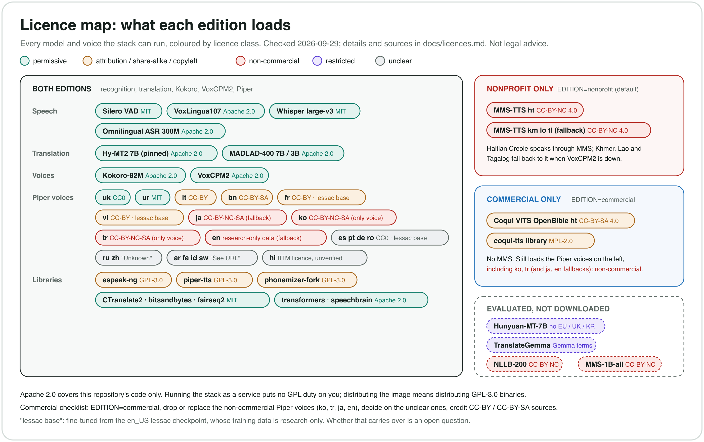

# Model and library licences

**This repository's code is Apache 2.0. The models it downloads are not part of
it, and each keeps its own licence.** Some of those are non-commercial, some
carry share-alike or attribution duties, and a few have no clear licence at
all. This page lists every model, voice and notable library the stack can
download or run, with its licence and a link to the primary source.

Checked on **2026-09-29** against the Hugging Face model cards and `LICENSE`
files, the GitHub repositories, PyPI metadata and each Piper voice's
`MODEL_CARD`. Upstream licences change: check the links before you rely on
this, and re-check whenever you change a pinned revision.

> **Not legal advice.** This is an engineering summary written to help you
> find the questions, not a legal opinion. Where a licence is ambiguous we say
> so. If you are selling a service or redistributing the image, have someone
> qualified read the linked licences.



## Contents

1. [The short version](#1-the-short-version)
2. [Editions: what `EDITION` changes](#2-editions-what-edition-changes)
3. [Every language, per edition](#3-every-language-per-edition)
4. [Speech: detection and recognition](#4-speech-detection-and-recognition)
5. [Translation](#5-translation)
6. [Voices](#6-voices)
7. [Piper voices, one by one](#7-piper-voices-one-by-one)
8. [Libraries](#8-libraries)
9. [Evaluated but not deployed](#9-evaluated-but-not-deployed)
10. [Before you deploy commercially](#10-before-you-deploy-commercially)
11. [Replacing the non-commercial voices](#11-replacing-the-non-commercial-voices)

## 1. The short version

| | Class | What it means here |
|---|---|---|
| ✅ | **Permissive** | MIT, Apache 2.0, BSD, CC0. Commercial use is allowed; keep the licence and notices. |
| ⚠️ | **Attribution or share-alike** | CC-BY, CC-BY-SA, MPL-2.0, GPL-3.0. Commercial use is allowed, with duties: credit the source, and for share-alike or copyleft, pass the same licence on when you distribute. |
| ⛔ | **Non-commercial** | CC-BY-NC, CC-BY-NC-SA, or a research-only dataset licence. Not for commercial use. |
| ⚠️ | **Restricted** | Territory exclusions, user caps or usage policies (for example Tencent's Hunyuan Community Licence, Google's Gemma terms). None of these is in the default stack. |
| ❓ | **Unclear** | No licence declared, a dead link, or a voice fine-tuned from a dataset whose licence may carry over. Treat as "ask first". |

- **Recognition and translation are clean in both editions.** Whisper large-v3
  (MIT), Omnilingual ASR (Apache 2.0), VoxLingua107 (Apache 2.0), Silero VAD
  (MIT), Hy-MT2 7B (Apache 2.0, at the pinned revision) and MADLAD-400
  (Apache 2.0).
- **Hy-MT2 7B is not under the Hunyuan Community Licence.** Its pinned
  revision's `LICENSE.txt` is the plain Apache 2.0 text, with no territory or
  user-count clause. The older **Hunyuan-MT-7B** *is* under that licence (it
  excludes the EU, the UK and South Korea): don't swap it in. Details in
  [section 5](#5-translation).
- **The non-commercial parts are voices.** Meta's MMS-TTS (⛔ CC-BY-NC 4.0)
  and several Piper voices: **Korean** (`ko_KR-kss`), **Turkish**
  (`tr_TR-dfki`) and the **Japanese** fallback (`ja_JP-hi_fi_captain`) are
  trained on CC-BY-NC-SA data, the **English** fallback (`en_US-lessac`) on a
  research-only dataset, and 12 more are fine-tuned from `lessac` or have no
  clear data licence (❓).
- **`EDITION=commercial` is enforced by code.** The licence of every model and
  voice is data ([`server/licences.py`](../server/licences.py)), and a
  commercial stack loads only ✅ and ⚠️ items: never a ⛔ one, not even as a
  fallback, and a ❓ one only after your own review (`[licence_review]`). The
  server applies it at startup, whatever the flags; `python3
  server/stack_config.py check --edition commercial` shows the result first.
  Languages that lose their voice get a licence-clean replacement (VoxCPM2
  or a Piper voice trained from scratch on public-domain or CC-BY
  data), or eSpeak NG, the robotic last-resort voice (Persian, Romanian).
  A language with no voice left at all (Khmer, Lao, Tagalog when VoxCPM2 is
  not running) is **text only**. See
  [section 2](#2-editions-what-edition-changes).
- **GPL-3.0 code runs inside the stack**: espeak-ng (a system package, and
  bundled by the phonemiser wheels), `piper-tts` and `phonemizer-fork`. That
  doesn't affect running the stack, even as a service. It matters if you
  **distribute** the Docker image or a pre-filled volume. See
  [section 8](#8-libraries).
- **A new engine brings its own licence.** Recognisers, translators and voices
  are plug-ins (`server/engines/`, [adding-an-engine.md](dev/adding-an-engine.md)).
  Whoever adds one adds its weights and library here, in the table for its
  kind, before it serves anyone; `python3 server/stack_config.py engines` lists
  every registered engine with the licence it declares. The `echo` translator
  is a test engine with no model.

## 2. Editions: what `EDITION` changes

`EDITION` is read by `scripts/run.sh` (and so by `scripts/docker-entrypoint.sh`
and `scripts/runpod/runpod-start.sh`), which passes it to the server as
`--edition`. Recognition and translation are identical in both editions (all
✅); only the voices differ.

| | `EDITION=nonprofit` (default) | `EDITION=commercial` |
|---|---|---|
| What may load | everything configured | ✅ permissive and ⚠️ attribution/share-alike only; ❓ unclear only with a `[licence_review]` entry; ⛔ never |
| Voices | each language's own (`[<lang>]` in `languages.toml`) | `[<lang>.commercial]` where given, else the language's own minus what may not load |
| Meta MMS-TTS (⛔ CC-BY-NC 4.0) | Haitian Creole, fallback for km lo tl | never constructed, even with `--mms` |
| Coqui OpenBible (⚠️ CC-BY-SA 4.0) | not started | Haitian Creole |
| ⛔ / ❓ Piper voices | loaded | never fetched, never loaded |
| A language left with only the last-resort voice | – | **eSpeak NG only** (fa, ro): its chain is just `espeak` in `check` and at startup |
| A language left with no voice | – | **TEXT ONLY** (none by default; km lo tl if VoxCPM2 is not running), said by `check` and at startup |
| Startup | `[licence] edition nonprofit` | `[licence]` lines per language: the chain, its licences, credits owed, TEXT ONLY |

**How it is enforced.** Two places, with the same function
(`stack_config.apply_edition`), so neither the command line nor the order of
engines can get round it:

1. `python3 server/stack_config.py check --edition commercial` (or with
   `EDITION=commercial`) prints, per language, the recogniser, translator and
   voice chain with each licence class, the credits owed, what was left out
   and which languages are text only; it exits non-zero when a `[models]` entry
   may not load. `scripts/run.sh` prints it before anything loads, and
   `fetch-voices.sh` downloads only the edition's voices.
2. At runtime the server's `EngineSet` re-derives the language table for its
   edition before any engine is built, refuses to construct an engine whose
   licence is not allowed (MMS; an unclassified plug-in), filters every voice
   chain again as it is built, and raises if a non-commercial item is still
   configured. The server also refuses to start commercial when a shared model
   (`[models]`, or `--asr-model`) is not classified as allowed: a Hy-MT2
   revision other than the one whose licence was read is ❓.

**The data.** [`server/licences.py`](../server/licences.py) has one entry per
engine, per Piper voice (from its `MODEL_CARD`), per Coqui checkpoint and per
`[models]` repo: class, the licence as stated, why, the source URL, and for ⚠️
the credit it needs. A plug-in engine may declare its own (`licence_class` on
the class); one that declares nothing is ❓. `tests/test_licences.py` fails when
`languages.toml` or the defaults name a voice or model without an entry, and
when the tables in sections 3 and 7 here drift from the data (they are
generated: `python3 server/stack_config.py docs`).

**Unclear items: your own review.** A ❓ item loads in commercial only when you
have looked at it yourself and written that down in `languages.toml`:

```toml
[licence_review]
"de_DE-thorsten-high" = "reviewed 2026-10-01 by Example Org: CC0 data; we accept the lessac fine-tune"
```

The key is the voice name, repo or engine; the value says who, when and why
(`check` refuses an empty one). It admits that one item. There is no override
for ⛔: a review naming one is an error. `COMMERCIAL_ALLOW_UNCLEAR=1` admits
every ❓ item at once and says so loudly at startup and in `check`.

**Capacity.** VoxCPM2 is one model per GPU that makes one voice at a time,
and commercial routes ten languages to it (section 3; why VoxCPM2:
[section 11](#11-replacing-the-non-commercial-voices)). At the A100's RTF of
0.28 a five-second sentence takes ~1.4 s, so one GPU keeps about three
listeners in real time (about two on an RTX PRO 4500, RTF 0.46). A commercial
stack starts one instance per GPU with room (`VOXCPM_INSTANCES=auto`); each
takes one sentence at a time (`VOXCPM_MAX_INFLIGHT=1`), and the server queues
the rest for the first free instance on any GPU. A sentence that waits more
than `VOXCPM_QUEUE_S` (2 s, about one long sentence's generation, hidden
behind the previous sentence still playing) is spoken by eSpeak NG instead, so
a busy room hears some sentences in the robotic voice rather than audio falling
behind the captions. Khmer, Lao and Tagalog have nothing after VoxCPM2 and wait
up to `VOXCPM_WAIT_S` (15 s). Other languages are unaffected. Each connection's
audio is made separately: two connections in Korean are two voices. Options:
more GPUs, accept it for rooms that rarely mix many of these languages, serve
some as eSpeak NG or text (drop `voxcpm = true` from `[<lang>.commercial]`),
or train Piper voices ([section 11.6](#116-the-long-term-path-our-own-voices))
to move them onto the CPU. How to size it:
[the user guide, "GPUs and capacity"](user-guide.md#gpus-and-capacity).

**What the commercial edition guarantees, and what stays yours.** It
guarantees that the stack does not download or load a model or voice this
repository classifies as non-commercial, or as unclear without your recorded
review, and that it tells you what it serves and what credit you owe. It does
not make the classification legal advice, check licences upstream after
2026-09-29, display the credits for you, or cover what you distribute (the
GPL libraries in [section 8](#8-libraries), the model files themselves). Those
stay with the operator.

## 3. Every language, per edition

Recognition and translation are the same in both editions. The voice columns
list the chain in order; the first is what listeners normally hear. Generated
from `server/licences.py` and the defaults (`python3 server/stack_config.py
docs`); your own `languages.toml` may differ, and `check --edition commercial`
shows yours.

<!-- generated: languages -->
| Lang | Recognition | Translation into it | Voice, `nonprofit` | Voice, `commercial` | Commercial notes |
|---|---|---|---|---|---|
| en | Whisper | Hy-MT2 | Kokoro `am_michael` ✅ › Piper `lessac` ⛔ › eSpeak NG ⚠️ | Kokoro `am_michael` ✅ › Piper `norman` ✅ › eSpeak NG ⚠️ | new: Piper `en_US-norman-medium` (public-domain LibriVox recordings, trained from scratch (Bryce Beattie)); replaced: Piper `lessac` ⛔ |
| es | Whisper | Hy-MT2 | Kokoro `ef_dora` ✅ › Piper `davefx` ❓ › eSpeak NG ⚠️ | Kokoro `ef_dora` ✅ › Piper `carlfm` ✅ › eSpeak NG ⚠️ | new: Piper `es_ES-carlfm-x_low` (public-domain dataset, trained from scratch (x_low: 16 kHz, the only clean Spanish Piper voice)); replaced: Piper `davefx` ❓ |
| fr | Whisper | Hy-MT2 | Kokoro `ff_siwis` ✅ › Piper `siwis` ❓ › eSpeak NG ⚠️ | Kokoro `ff_siwis` ✅ › Piper `mls` ⚠️ › eSpeak NG ⚠️ | ⚠️ CC-BY 4.0: credit Multilingual LibriSpeech (Pratap et al., 2020); new: Piper `fr_FR-mls-medium` (CC-BY dataset, trained from scratch); replaced: Piper `siwis` ❓ |
| pt | Whisper | Hy-MT2 | Kokoro `pf_dora` ✅ › Piper `faber` ❓ › eSpeak NG ⚠️ | Kokoro `pf_dora` ✅ › eSpeak NG ⚠️ | not loaded: Piper `faber` ❓ |
| it | Whisper | Hy-MT2 | Kokoro `if_sara` ✅ › Piper `serena` ⚠️ › eSpeak NG ⚠️ | Kokoro `if_sara` ✅ › Piper `serena` ⚠️ › eSpeak NG ⚠️ | ⚠️ CC-BY 4.0: credit the serena-synthetic-it-27h dataset (committa) |
| de | Whisper | Hy-MT2 | Piper `thorsten` ❓ › eSpeak NG ⚠️ | Piper `mls` ⚠️ › eSpeak NG ⚠️ | ⚠️ CC-BY 4.0: credit Multilingual LibriSpeech (Pratap et al., 2020); new: Piper `de_DE-mls-medium` (CC-BY dataset, trained from scratch); replaced: Piper `thorsten` ❓ |
| ru | Whisper | Hy-MT2 | Piper `irina` ❓ › eSpeak NG ⚠️ | VoxCPM2 ✅ › eSpeak NG ⚠️ | new: VoxCPM2 (shared GPU capacity, §2); replaced: Piper `irina` ❓ |
| uk | Whisper | Hy-MT2 | Piper `ukrainian_tts` ✅ › eSpeak NG ⚠️ | Piper `ukrainian_tts` ✅ › eSpeak NG ⚠️ | ✅ unchanged |
| zh | Whisper | Hy-MT2 | Kokoro `zf_xiaobei` ✅ › Piper `huayan` ❓ › eSpeak NG ⚠️ | Kokoro `zf_xiaobei` ✅ › eSpeak NG ⚠️ | not loaded: Piper `huayan` ❓ |
| ja | Whisper | Hy-MT2 | Kokoro `jf_alpha` ✅ › Piper `hi_fi_captain` ⛔ | Kokoro `jf_alpha` ✅ | not loaded: Piper `hi_fi_captain` ⛔ |
| ko | Whisper | Hy-MT2 | Piper `kss` ⛔ › eSpeak NG ⚠️ | VoxCPM2 ✅ › eSpeak NG ⚠️ | new: VoxCPM2 (shared GPU capacity, §2); replaced: Piper `kss` ⛔ |
| vi | Whisper | Hy-MT2 | Piper `vais1000` ❓ › eSpeak NG ⚠️ | VoxCPM2 ✅ › eSpeak NG ⚠️ | new: VoxCPM2 (shared GPU capacity, §2); replaced: Piper `vais1000` ❓ |
| ar | Whisper | Hy-MT2 | Piper `kareem` ❓ › eSpeak NG ⚠️ | VoxCPM2 ✅ › eSpeak NG ⚠️ | new: VoxCPM2 (shared GPU capacity, §2); replaced: Piper `kareem` ❓ |
| fa | Omnilingual | Hy-MT2 | Piper `gyro` ❓ › eSpeak NG ⚠️ | eSpeak NG ⚠️ | **eSpeak NG only** (robotic; was text only); not loaded: Piper `gyro` ❓ |
| id | Whisper | Hy-MT2 | Piper `news_tts` ❓ › eSpeak NG ⚠️ | VoxCPM2 ✅ › eSpeak NG ⚠️ | new: VoxCPM2 (shared GPU capacity, §2); replaced: Piper `news_tts` ❓ |
| tr | Whisper | Hy-MT2 | Piper `dfki` ⛔ › eSpeak NG ⚠️ | VoxCPM2 ✅ › eSpeak NG ⚠️ | new: VoxCPM2 (shared GPU capacity, §2); replaced: Piper `dfki` ⛔ |
| bn | Omnilingual | Hy-MT2 | Piper `google` ⚠️ › eSpeak NG ⚠️ | Piper `google` ⚠️ › eSpeak NG ⚠️ | ⚠️ CC-BY-SA 4.0: credit Google's OpenSLR 37 Bengali corpus and keep the CMU notice |
| ur | Omnilingual | Hy-MT2 | Piper `aegis_female` ✅ › eSpeak NG ⚠️ | Piper `aegis_female` ✅ › eSpeak NG ⚠️ | ✅ unchanged |
| hi | Omnilingual | Hy-MT2 | Kokoro `hf_alpha` ✅ › Piper `rohan` ❓ › eSpeak NG ⚠️ | Kokoro `hf_alpha` ✅ › eSpeak NG ⚠️ | not loaded: Piper `rohan` ❓ |
| sw | Omnilingual | MADLAD | Piper `lanfrica` ❓ › eSpeak NG ⚠️ | VoxCPM2 ✅ › eSpeak NG ⚠️ | new: VoxCPM2 (shared GPU capacity, §2); replaced: Piper `lanfrica` ❓ |
| ro | Whisper | MADLAD | Piper `mihai` ❓ › eSpeak NG ⚠️ | eSpeak NG ⚠️ | **eSpeak NG only** (robotic; was text only); not loaded: Piper `mihai` ❓ |
| ht | Omnilingual | MADLAD | MMS `mms-tts-hat` ⛔ › eSpeak NG ⚠️ | Coqui `VITS-OpenBible-Haitian-Creole` ⚠️ › eSpeak NG ⚠️ | ⚠️ CC-BY-SA 4.0: credit multilingual-tts / Open Bible; share adaptations of the model under CC-BY-SA; not loaded: MMS `mms-tts-hat` ⛔ |
| km | Omnilingual | Hy-MT2 | VoxCPM2 ✅ › MMS `mms-tts-khm` ⛔ | VoxCPM2 ✅ | not loaded: MMS `mms-tts-khm` ⛔ |
| lo | Omnilingual | MADLAD | VoxCPM2 ✅ › MMS `mms-tts-lao` ⛔ | VoxCPM2 ✅ | not loaded: MMS `mms-tts-lao` ⛔ |
| tl | Whisper | Hy-MT2 | VoxCPM2 ✅ › MMS `mms-tts-tgl` ⛔ | VoxCPM2 ✅ | not loaded: MMS `mms-tts-tgl` ⛔ |
<!-- end generated: languages -->

"Translation into it" is the model used when this is the *target*. A source
language outside Hy-MT2's 36 (Swahili, Romanian, Haitian Creole, Lao) reaches
the other languages through MADLAD. Every recogniser, both translators, Silero
VAD and VoxLingua107 are ✅ in both editions.

## 4. Speech: detection and recognition

| Model | Used for | Licence | Class | Source |
|---|---|---|---|---|
| **Silero VAD** | speech/silence, sentence ends | MIT (code and model) | ✅ | [snakers4/silero-vad LICENSE](https://github.com/snakers4/silero-vad/blob/master/LICENSE). Loaded with `torch.hub` at a pinned commit, the one tag v6.2.3 points to (`[models.vad]`). |
| **VoxLingua107 ECAPA** (SpeechBrain) | which language is being spoken (`src=auto`) | Apache 2.0 | ✅ | [speechbrain/lang-id-voxlingua107-ecapa](https://huggingface.co/speechbrain/lang-id-voxlingua107-ecapa). Its training set, [VoxLingua107](https://cs.taltech.ee/staff/tanel.alumae/data/voxlingua107/), is CC-BY 4.0. |
| **Whisper large-v3** | recognition, all but the Omnilingual languages | MIT (code and weights) | ✅ | [openai/whisper LICENSE](https://github.com/openai/whisper/blob/main/LICENSE): "Whisper's code and model weights are released under the MIT License." The [Hugging Face card](https://huggingface.co/openai/whisper-large-v3) is tagged `apache-2.0`; both are permissive. |
| **faster-whisper large-v3** (CTranslate2 conversion, what the stack actually downloads) | same | MIT | ✅ | [Systran/faster-whisper-large-v3](https://huggingface.co/Systran/faster-whisper-large-v3) |
| distil-large-v3 (`server/server.py`'s default `--asr-model`; `scripts/run.sh` overrides it with large-v3) | not used by `scripts/run.sh` | MIT | ✅ | [distil-whisper/distil-large-v3](https://huggingface.co/distil-whisper/distil-large-v3), [Systran/faster-distil-whisper-large-v3](https://huggingface.co/Systran/faster-distil-whisper-large-v3) |
| **Omnilingual ASR 300M** (`omniASR_LLM_300M`, Meta) | recognition for fa, bn, ur, hi, sw, ht, km, lo | Apache 2.0 (code and models) | ✅ | [facebookresearch/omnilingual-asr](https://github.com/facebookresearch/omnilingual-asr): "Omnilingual ASR code and models are released under the Apache 2.0." Weights: [facebook/omniASR-LLM-300M](https://huggingface.co/facebook/omniASR-LLM-300M) (`apache-2.0`). |

## 5. Translation

| Model | Used for | Licence | Class | Source |
|---|---|---|---|---|
| **Hy-MT2 7B** (Tencent), pinned `9b0eb4e8f001def3e5ff6469a0ac96fdb39ec223`, quantised to 4-bit NF4 by `scripts/prepare-mt.sh` | translation into its 36 languages | Apache 2.0 | ✅ | [tencent/Hy-MT2-7B `LICENSE.txt` at that revision](https://huggingface.co/tencent/Hy-MT2-7B/blob/9b0eb4e8f001def3e5ff6469a0ac96fdb39ec223/LICENSE.txt) |
| **MADLAD-400 7B MT** (Google), pinned `1ff63ce7ddd571a69d45cad9672c553428419671`, converted to CTranslate2 int8 | everything Hy-MT2 doesn't cover (sw, ro, ht, lo) | Apache 2.0 | ✅ | [google/madlad400-7b-mt](https://huggingface.co/google/madlad400-7b-mt) |
| **MADLAD-400 3B MT**, pinned `fa184c675da0b5c9e1c8694fccd4e12e2d422094` (`MADLAD=3b`, and the source of `server/server.py`'s default tokenizer) | the smaller fallback | Apache 2.0 | ✅ | [google/madlad400-3b-mt](https://huggingface.co/google/madlad400-3b-mt) |

**Hy-MT2 and the Hunyuan Community Licence.** Tencent's earlier Hunyuan models
use the *Tencent Hunyuan Community License Agreement*, which is not an
open-source licence. **Hy-MT2-7B at the pinned revision is not under it.** Its
`LICENSE.txt` reads, in full apart from the Apache 2.0 text that follows:

> Tencent is pleased to support the open-source community by making Hy-MT2-7B available.
> Copyright (C) 2026 Tencent. All rights reserved.
> Hy-MT2-7B is licensed under the Apache License, Version 2.0.

The model card's metadata says `license: apache-2.0`, and the README has no
extra use terms. `scripts/prepare-mt.sh` copies that `LICENSE.txt` next to the
quantised model and writes a `PROVENANCE.txt` noting the modification (Apache
2.0 section 4(b)).

The previous model, [tencent/Hunyuan-MT-7B](https://huggingface.co/tencent/Hunyuan-MT-7B/blob/main/License.txt),
is under the Tencent Hunyuan Community License (release date 1 September 2025),
which says:

> THIS LICENSE AGREEMENT DOES NOT APPLY IN THE EUROPEAN UNION, UNITED KINGDOM AND SOUTH KOREA AND IS EXPRESSLY LIMITED TO THE TERRITORY, AS DEFINED BELOW.
>
> "Territory" shall mean the worldwide territory, excluding the territory of the European Union, United Kingdom and South Korea.
>
> You must not use, reproduce, modify, distribute, or display the Tencent Hunyuan Works, Output or results of the Tencent Hunyuan Works outside the Territory.
>
> If, on the Tencent Hunyuan version release date, the monthly active users of all products or services made available by or for Licensee is greater than 100 million monthly active users in the preceding calendar month, You must request a license from Tencent […]

So: keep the pinned Hy-MT2 revision, **don't substitute Hunyuan-MT-7B or another
Hunyuan model** without reading its licence, and re-check `LICENSE.txt` whenever
you move the Hy-MT2 revision (`languages.toml`, `[models.hymt]`). If you want no Tencent model at all, set
`translator = "madlad"` for every language in `languages.toml` (and don't run
`scripts/prepare-mt.sh`'s Hy-MT2 step, or delete `/workspace/mt/hymt2-7b-nf4`, so
`scripts/run.sh` doesn't load it). MADLAD 7B scored 87% against Hy-MT2's 95% in the
[evaluation](dev/model-evaluation.md).

## 6. Voices

| Model | Used for | Licence | Class | Source |
|---|---|---|---|---|
| **Kokoro-82M** (hexgrad) | en es fr it pt ja zh hi | Apache 2.0 | ✅ | [hexgrad/Kokoro-82M](https://huggingface.co/hexgrad/Kokoro-82M): "trained exclusively on permissive/non-copyrighted audio data"; the card lists the CC-BY audio it used (e.g. SIWIS, Koniwa). Code: [hexgrad/kokoro](https://github.com/hexgrad/kokoro) (Apache 2.0). |
| **VoxCPM2** (OpenBMB), pinned `32279effe8c19989596f05d353d1447f51d9e915` | km lo tl; in commercial also the languages section 3 lists | Apache 2.0 | ✅ | [openbmb/VoxCPM2](https://huggingface.co/openbmb/VoxCPM2): "Released under the Apache-2.0 license, free for commercial use." Code: [OpenBMB/VoxCPM](https://github.com/OpenBMB/VoxCPM). The reference clips in `voices/voxcpm/` were generated by VoxCPM2 itself (synthetic speakers). |
| **Meta MMS-TTS** `facebook/mms-tts-khm`, `-lao`, `-tgl`, `-hat` | ht (nonprofit), fallback for km lo tl | **CC-BY-NC 4.0** | ⛔ | [facebook/mms-tts-hat](https://huggingface.co/facebook/mms-tts-hat) ("The model is licensed as CC-BY-NC 4.0"), and the same on [khm](https://huggingface.co/facebook/mms-tts-khm), [lao](https://huggingface.co/facebook/mms-tts-lao), [tgl](https://huggingface.co/facebook/mms-tts-tgl). `EDITION=nonprofit` only. |
| **Coqui VITS OpenBible, Haitian Creole** | ht (commercial) | **CC-BY-SA 4.0** | ⚠️ | [multilingual-tts/VITS-OpenBible-Haitian-Creole](https://huggingface.co/multilingual-tts/VITS-OpenBible-Haitian-Creole). Trained on the [Open Bible](https://huggingface.co/datasets/davidguzmanr/open-bible-resources) corpus. Share-alike: credit it, and anything you distribute that adapts the model must carry CC-BY-SA. Its audio output is generally not considered an adaptation of the model, but that's a grey area. |
| **Piper voices** | 21 languages, see below | per voice | mixed | [rhasspy/piper-voices](https://huggingface.co/rhasspy/piper-voices). The repository is tagged MIT, but **each voice's `MODEL_CARD` names its training data and that data's licence**, which is what matters. |
| CosyVoice2 0.5B | only with `server/server.py --clone`; no script here installs it (the server looks for `pretrained_models/CosyVoice2-0.5B`); not in `scripts/run.sh` | Apache 2.0 | ✅ | [FunAudioLLM/CosyVoice2-0.5B](https://huggingface.co/FunAudioLLM/CosyVoice2-0.5B) |

## 7. Piper voices, one by one

From each voice's `MODEL_CARD`
(`https://huggingface.co/rhasspy/piper-voices/resolve/main/<lang>/<locale>/<name>/<quality>/MODEL_CARD`),
fetched 2026-09-29. "Base" is the checkpoint the voice was fine-tuned from.
The configured voices, the commercial replacements, and the candidates checked
and rejected for them; generated from `server/licences.py`.

<!-- generated: piper -->
| Lang | Voice | Dataset licence (as the card states it) | Base | Class | Used in |
|---|---|---|---|---|---|
| en | [`en_GB-cori-high`](https://huggingface.co/rhasspy/piper-voices/blob/c10ece1aade47bb51c153c893d14e5bf8e5b7117/en/en_GB/cori/high/MODEL_CARD) | public domain (LibriVox) | trained from scratch | ✅ | candidate, not used |
| en | [`en_US-hfc_female-medium`](https://huggingface.co/rhasspy/piper-voices/blob/c10ece1aade47bb51c153c893d14e5bf8e5b7117/en/en_US/hfc_female/medium/MODEL_CARD) | CC-BY-NC-SA 4.0 (Hi-Fi-CAPTAIN) | lessac | ⛔ | candidate, not used |
| en | [`en_US-joe-medium`](https://huggingface.co/rhasspy/piper-voices/blob/c10ece1aade47bb51c153c893d14e5bf8e5b7117/en/en_US/joe/medium/MODEL_CARD) | CC0 | lessac | ❓ | candidate, not used |
| en | [`en_US-john-medium`](https://huggingface.co/rhasspy/piper-voices/blob/c10ece1aade47bb51c153c893d14e5bf8e5b7117/en/en_US/john/medium/MODEL_CARD) | public domain (LibriVox) | kristin (public domain) | ✅ | candidate, not used |
| en | [`en_US-kristin-medium`](https://huggingface.co/rhasspy/piper-voices/blob/c10ece1aade47bb51c153c893d14e5bf8e5b7117/en/en_US/kristin/medium/MODEL_CARD) | public domain (LibriVox) | trained from scratch | ✅ | candidate, not used |
| en | [`en_US-l2arctic-medium`](https://huggingface.co/rhasspy/piper-voices/blob/c10ece1aade47bb51c153c893d14e5bf8e5b7117/en/en_US/l2arctic/medium/MODEL_CARD) | CC-BY-NC 4.0 (L2-ARCTIC) | lessac | ⛔ | candidate, not used |
| en | [`en_US-lessac-high`](https://huggingface.co/rhasspy/piper-voices/blob/c10ece1aade47bb51c153c893d14e5bf8e5b7117/en/en_US/lessac/high/MODEL_CARD) | Blizzard 2013 Lessac licence (research only) | trained from scratch | ⛔ | candidate, not used |
| en | [`en_US-lessac-medium`](https://huggingface.co/rhasspy/piper-voices/blob/c10ece1aade47bb51c153c893d14e5bf8e5b7117/en/en_US/lessac/medium/MODEL_CARD) | Blizzard 2013 Lessac licence (research only) | trained from scratch | ⛔ | nonprofit |
| en | [`en_US-libritts-high`](https://huggingface.co/rhasspy/piper-voices/blob/c10ece1aade47bb51c153c893d14e5bf8e5b7117/en/en_US/libritts/high/MODEL_CARD) | CC-BY 4.0 (LibriTTS) | trained from scratch | ⚠️ | candidate, not used |
| en | [`en_US-ljspeech-high`](https://huggingface.co/rhasspy/piper-voices/blob/c10ece1aade47bb51c153c893d14e5bf8e5b7117/en/en_US/ljspeech/high/MODEL_CARD) | public domain (LJ Speech) | trained from scratch | ✅ | candidate, not used |
| en | [`en_US-norman-medium`](https://huggingface.co/rhasspy/piper-voices/blob/c10ece1aade47bb51c153c893d14e5bf8e5b7117/en/en_US/norman/medium/MODEL_CARD) | public domain (LibriVox) | trained from scratch | ✅ | commercial |
| en | [`en_US-ryan-high`](https://huggingface.co/rhasspy/piper-voices/blob/c10ece1aade47bb51c153c893d14e5bf8e5b7117/en/en_US/ryan/high/MODEL_CARD) | CC-BY-NC-SA 4.0 (RyanSpeech) | trained from scratch | ⛔ | candidate, not used |
| es | [`es_AR-daniela-high`](https://huggingface.co/rhasspy/piper-voices/blob/c10ece1aade47bb51c153c893d14e5bf8e5b7117/es/es_AR/daniela/high/MODEL_CARD) | CC-BY-SA 4.0 (OpenSLR 61) | lessac | ❓ | candidate, not used |
| es | [`es_ES-carlfm-x_low`](https://huggingface.co/rhasspy/piper-voices/blob/c10ece1aade47bb51c153c893d14e5bf8e5b7117/es/es_ES/carlfm/x_low/MODEL_CARD) | public domain | trained from scratch | ✅ | commercial |
| es | [`es_ES-davefx-medium`](https://huggingface.co/rhasspy/piper-voices/blob/c10ece1aade47bb51c153c893d14e5bf8e5b7117/es/es_ES/davefx/medium/MODEL_CARD) | CC0 | lessac | ❓ | nonprofit |
| es | [`es_ES-sharvard-medium`](https://huggingface.co/rhasspy/piper-voices/blob/c10ece1aade47bb51c153c893d14e5bf8e5b7117/es/es_ES/sharvard/medium/MODEL_CARD) | CC-BY 3.0 (Sharvard) | lessac | ❓ | candidate, not used |
| es | [`es_MX-ald-medium`](https://huggingface.co/rhasspy/piper-voices/blob/c10ece1aade47bb51c153c893d14e5bf8e5b7117/es/es_MX/ald/medium/MODEL_CARD) | Unlicense | davefx (lessac) | ❓ | candidate, not used |
| es | [`es_MX-claude-high`](https://huggingface.co/rhasspy/piper-voices/blob/c10ece1aade47bb51c153c893d14e5bf8e5b7117/es/es_MX/claude/high/MODEL_CARD) | apache-2.0 (as stated) | not stated | ❓ | candidate, not used |
| fr | [`fr_FR-gilles-low`](https://huggingface.co/rhasspy/piper-voices/blob/c10ece1aade47bb51c153c893d14e5bf8e5b7117/fr/fr_FR/gilles/low/MODEL_CARD) | CC0 | ryan | ❓ | candidate, not used |
| fr | [`fr_FR-mls-medium`](https://huggingface.co/rhasspy/piper-voices/blob/c10ece1aade47bb51c153c893d14e5bf8e5b7117/fr/fr_FR/mls/medium/MODEL_CARD) | CC-BY 4.0 (Multilingual LibriSpeech, OpenSLR 94) | trained from scratch | ⚠️ | commercial |
| fr | [`fr_FR-siwis-medium`](https://huggingface.co/rhasspy/piper-voices/blob/c10ece1aade47bb51c153c893d14e5bf8e5b7117/fr/fr_FR/siwis/medium/MODEL_CARD) | CC-BY 4.0 (SIWIS) | lessac | ❓ | nonprofit |
| fr | [`fr_FR-tom-medium`](https://huggingface.co/rhasspy/piper-voices/blob/c10ece1aade47bb51c153c893d14e5bf8e5b7117/fr/fr_FR/tom/medium/MODEL_CARD) | AGPLv3 (as stated, for a dataset) | not stated | ❓ | candidate, not used |
| fr | [`fr_FR-upmc-medium`](https://huggingface.co/rhasspy/piper-voices/blob/c10ece1aade47bb51c153c893d14e5bf8e5b7117/fr/fr_FR/upmc/medium/MODEL_CARD) | CC-BY-SA 4.0 (UPMC Pierre) | lessac | ❓ | candidate, not used |
| pt | [`pt_BR-cadu-medium`](https://huggingface.co/rhasspy/piper-voices/blob/c10ece1aade47bb51c153c893d14e5bf8e5b7117/pt/pt_BR/cadu/medium/MODEL_CARD) | CC0 | lessac | ❓ | candidate, not used |
| pt | [`pt_BR-edresson-low`](https://huggingface.co/rhasspy/piper-voices/blob/c10ece1aade47bb51c153c893d14e5bf8e5b7117/pt/pt_BR/edresson/low/MODEL_CARD) | CC-BY 4.0 | ryan | ❓ | candidate, not used |
| pt | [`pt_BR-faber-medium`](https://huggingface.co/rhasspy/piper-voices/blob/c10ece1aade47bb51c153c893d14e5bf8e5b7117/pt/pt_BR/faber/medium/MODEL_CARD) | CC0 | lessac | ❓ | nonprofit |
| pt | [`pt_BR-jeff-medium`](https://huggingface.co/rhasspy/piper-voices/blob/c10ece1aade47bb51c153c893d14e5bf8e5b7117/pt/pt_BR/jeff/medium/MODEL_CARD) | CC0 | lessac | ❓ | candidate, not used |
| pt | [`pt_PT-tugão-medium`](https://huggingface.co/rhasspy/piper-voices/blob/c10ece1aade47bb51c153c893d14e5bf8e5b7117/pt/pt_PT/tugão/medium/MODEL_CARD) | CC0 | lessac | ❓ | candidate, not used |
| it | [`it_IT-paola-medium`](https://huggingface.co/rhasspy/piper-voices/blob/c10ece1aade47bb51c153c893d14e5bf8e5b7117/it/it_IT/paola/medium/MODEL_CARD) | "See URL" | lessac | ❓ | candidate, not used |
| it | [`it_IT-serena-high`](https://huggingface.co/rhasspy/piper-voices/blob/c10ece1aade47bb51c153c893d14e5bf8e5b7117/it/it_IT/serena/high/MODEL_CARD) | CC-BY 4.0 (synthetic, serena-synthetic-it-27h) | trained from scratch | ⚠️ | nonprofit and commercial |
| it | [`it_IT-serena-medium`](https://huggingface.co/rhasspy/piper-voices/blob/c10ece1aade47bb51c153c893d14e5bf8e5b7117/it/it_IT/serena/medium/MODEL_CARD) | CC-BY 4.0 (synthetic, serena-synthetic-it-27h) | trained from scratch | ⚠️ | candidate, not used |
| de | [`de_DE-eva_k-x_low`](https://huggingface.co/rhasspy/piper-voices/blob/c10ece1aade47bb51c153c893d14e5bf8e5b7117/de/de_DE/eva_k/x_low/MODEL_CARD) | "See URL" (M-AILABS) | trained from scratch | ❓ | candidate, not used |
| de | [`de_DE-kerstin-low`](https://huggingface.co/rhasspy/piper-voices/blob/c10ece1aade47bb51c153c893d14e5bf8e5b7117/de/de_DE/kerstin/low/MODEL_CARD) | CC0 | ryan | ❓ | candidate, not used |
| de | [`de_DE-mls-medium`](https://huggingface.co/rhasspy/piper-voices/blob/c10ece1aade47bb51c153c893d14e5bf8e5b7117/de/de_DE/mls/medium/MODEL_CARD) | CC-BY 4.0 (Multilingual LibriSpeech, OpenSLR 94) | trained from scratch | ⚠️ | commercial |
| de | [`de_DE-pavoque-low`](https://huggingface.co/rhasspy/piper-voices/blob/c10ece1aade47bb51c153c893d14e5bf8e5b7117/de/de_DE/pavoque/low/MODEL_CARD) | CC-BY-NC-SA 4.0 (PAVOQUE) | ryan | ⛔ | candidate, not used |
| de | [`de_DE-thorsten-high`](https://huggingface.co/rhasspy/piper-voices/blob/c10ece1aade47bb51c153c893d14e5bf8e5b7117/de/de_DE/thorsten/high/MODEL_CARD) | CC0 (Thorsten-Voice) | lessac | ❓ | nonprofit |
| de | [`de_DE-thorsten-medium`](https://huggingface.co/rhasspy/piper-voices/blob/c10ece1aade47bb51c153c893d14e5bf8e5b7117/de/de_DE/thorsten/medium/MODEL_CARD) | CC0 (Thorsten-Voice) | lessac | ❓ | candidate, not used |
| ru | [`ru_RU-denis-medium`](https://huggingface.co/rhasspy/piper-voices/blob/c10ece1aade47bb51c153c893d14e5bf8e5b7117/ru/ru_RU/denis/medium/MODEL_CARD) | CC0 | lessac | ❓ | candidate, not used |
| ru | [`ru_RU-dmitri-medium`](https://huggingface.co/rhasspy/piper-voices/blob/c10ece1aade47bb51c153c893d14e5bf8e5b7117/ru/ru_RU/dmitri/medium/MODEL_CARD) | CC0 | lessac | ❓ | candidate, not used |
| ru | [`ru_RU-irina-medium`](https://huggingface.co/rhasspy/piper-voices/blob/c10ece1aade47bb51c153c893d14e5bf8e5b7117/ru/ru_RU/irina/medium/MODEL_CARD) | "Unknown" (RHVoice) | lessac | ❓ | nonprofit |
| ru | [`ru_RU-ruslan-medium`](https://huggingface.co/rhasspy/piper-voices/blob/c10ece1aade47bb51c153c893d14e5bf8e5b7117/ru/ru_RU/ruslan/medium/MODEL_CARD) | CC-BY-NC-SA 4.0 (RUSLAN) | lessac | ⛔ | candidate, not used |
| uk | [`uk_UA-lada-x_low`](https://huggingface.co/rhasspy/piper-voices/blob/c10ece1aade47bb51c153c893d14e5bf8e5b7117/uk/uk_UA/lada/x_low/MODEL_CARD) | Apache 2.0 | trained from scratch | ✅ | candidate, not used |
| uk | [`uk_UA-ukrainian_tts-medium`](https://huggingface.co/rhasspy/piper-voices/blob/c10ece1aade47bb51c153c893d14e5bf8e5b7117/uk/uk_UA/ukrainian_tts/medium/MODEL_CARD) | CC0 | trained from scratch | ✅ | nonprofit and commercial |
| zh | [`zh_CN-chaowen-medium`](https://huggingface.co/rhasspy/piper-voices/blob/c10ece1aade47bb51c153c893d14e5bf8e5b7117/zh/zh_CN/chaowen/medium/MODEL_CARD) | CC0 | xiao_ya (non-commercial data) | ❓ | candidate, not used |
| zh | [`zh_CN-huayan-medium`](https://huggingface.co/rhasspy/piper-voices/blob/c10ece1aade47bb51c153c893d14e5bf8e5b7117/zh/zh_CN/huayan/medium/MODEL_CARD) | "Unknown" (HuaYan_TTS, repository gone) | lessac | ❓ | nonprofit |
| zh | [`zh_CN-xiao_ya-medium`](https://huggingface.co/rhasspy/piper-voices/blob/c10ece1aade47bb51c153c893d14e5bf8e5b7117/zh/zh_CN/xiao_ya/medium/MODEL_CARD) | non-commercial (DataBaker BZNSYP) | trained from scratch | ⛔ | candidate, not used |
| ja | [`ja_JP-hi_fi_captain-medium`](https://huggingface.co/rhasspy/piper-voices/blob/c10ece1aade47bb51c153c893d14e5bf8e5b7117/ja/ja_JP/hi_fi_captain/medium/MODEL_CARD) | CC-BY-NC-SA 4.0 (Hi-Fi-CAPTAIN) | LibriTTS-R | ⛔ | nonprofit |
| ko | [`ko_KR-kss-medium`](https://huggingface.co/rhasspy/piper-voices/blob/c10ece1aade47bb51c153c893d14e5bf8e5b7117/ko/ko_KR/kss/medium/MODEL_CARD) | CC-BY-NC-SA 4.0 (KSS) | LibriTTS-R | ⛔ | nonprofit |
| vi | [`vi_VN-25hours_single-low`](https://huggingface.co/rhasspy/piper-voices/blob/c10ece1aade47bb51c153c893d14e5bf8e5b7117/vi/vi_VN/25hours_single/low/MODEL_CARD) | "Unknown" (InfoRe) | ryan | ❓ | candidate, not used |
| vi | [`vi_VN-vais1000-medium`](https://huggingface.co/rhasspy/piper-voices/blob/c10ece1aade47bb51c153c893d14e5bf8e5b7117/vi/vi_VN/vais1000/medium/MODEL_CARD) | CC-BY 4.0 (VAIS-1000) | lessac | ❓ | nonprofit |
| vi | [`vi_VN-vivos-x_low`](https://huggingface.co/rhasspy/piper-voices/blob/c10ece1aade47bb51c153c893d14e5bf8e5b7117/vi/vi_VN/vivos/x_low/MODEL_CARD) | CC-BY-NC-SA 4.0 (VIVOS) | trained from scratch | ⛔ | candidate, not used |
| ar | [`ar_JO-kareem-medium`](https://huggingface.co/rhasspy/piper-voices/blob/c10ece1aade47bb51c153c893d14e5bf8e5b7117/ar/ar_JO/kareem/medium/MODEL_CARD) | "See URL": arabicttstrain declares no licence | lessac | ❓ | nonprofit |
| fa | [`fa_IR-amir-medium`](https://huggingface.co/rhasspy/piper-voices/blob/c10ece1aade47bb51c153c893d14e5bf8e5b7117/fa/fa_IR/amir/medium/MODEL_CARD) | CC0 | lessac | ❓ | candidate, not used |
| fa | [`fa_IR-ganji-medium`](https://huggingface.co/rhasspy/piper-voices/blob/c10ece1aade47bb51c153c893d14e5bf8e5b7117/fa/fa_IR/ganji/medium/MODEL_CARD) | CC0 | amir (lessac) | ❓ | candidate, not used |
| fa | [`fa_IR-gyro-medium`](https://huggingface.co/rhasspy/piper-voices/blob/c10ece1aade47bb51c153c893d14e5bf8e5b7117/fa/fa_IR/gyro/medium/MODEL_CARD) | "See URL" (a GitHub profile) | a Persian VITS voice | ❓ | nonprofit |
| fa | [`fa_IR-reza_ibrahim-medium`](https://huggingface.co/rhasspy/piper-voices/blob/c10ece1aade47bb51c153c893d14e5bf8e5b7117/fa/fa_IR/reza_ibrahim/medium/MODEL_CARD) | CC0 | lessac | ❓ | candidate, not used |
| id | [`id_ID-news_tts-medium`](https://huggingface.co/rhasspy/piper-voices/blob/c10ece1aade47bb51c153c893d14e5bf8e5b7117/id/id_ID/news_tts/medium/MODEL_CARD) | "See URL": links a Malayalam corpus notebook | lessac | ❓ | nonprofit |
| tr | [`tr_TR-dfki-medium`](https://huggingface.co/rhasspy/piper-voices/blob/c10ece1aade47bb51c153c893d14e5bf8e5b7117/tr/tr_TR/dfki/medium/MODEL_CARD) | CC-BY-NC-SA 4.0 (dfki-ot-data) | lessac | ⛔ | nonprofit |
| bn | [`bn_BD-google-medium`](https://huggingface.co/rhasspy/piper-voices/blob/c10ece1aade47bb51c153c893d14e5bf8e5b7117/bn/bn_BD/google/medium/MODEL_CARD) | CC-BY-SA 4.0 (OpenSLR 37) and the CMU licence | LibriTTS-R | ⚠️ | nonprofit and commercial |
| ur | [`ur_PK-aegis_female-medium`](https://huggingface.co/rhasspy/piper-voices/blob/c10ece1aade47bb51c153c893d14e5bf8e5b7117/ur/ur_PK/aegis_female/medium/MODEL_CARD) | MIT (the card's own licence; dataset not stated) | not stated | ✅ | nonprofit and commercial |
| ur | [`ur_PK-fasih-medium`](https://huggingface.co/rhasspy/piper-voices/blob/c10ece1aade47bb51c153c893d14e5bf8e5b7117/ur/ur_PK/fasih/medium/MODEL_CARD) | MIT (the card's own licence; dataset not stated) | not stated | ✅ | candidate, not used |
| hi | [`hi_IN-pratham-medium`](https://huggingface.co/rhasspy/piper-voices/blob/c10ece1aade47bb51c153c893d14e5bf8e5b7117/hi/hi_IN/pratham/medium/MODEL_CARD) | CC-BY-NC-SA 4.0 | not stated | ⛔ | candidate, not used |
| hi | [`hi_IN-priyamvada-medium`](https://huggingface.co/rhasspy/piper-voices/blob/c10ece1aade47bb51c153c893d14e5bf8e5b7117/hi/hi_IN/priyamvada/medium/MODEL_CARD) | CC-BY-NC-SA 4.0 | not stated | ⛔ | candidate, not used |
| hi | [`hi_IN-rohan-medium`](https://huggingface.co/rhasspy/piper-voices/blob/c10ece1aade47bb51c153c893d14e5bf8e5b7117/hi/hi_IN/rohan/medium/MODEL_CARD) | IIT Madras Indic TTS licence (unverified) | lessac | ❓ | nonprofit |
| sw | [`sw_CD-lanfrica-medium`](https://huggingface.co/rhasspy/piper-voices/blob/c10ece1aade47bb51c153c893d14e5bf8e5b7117/sw/sw_CD/lanfrica/medium/MODEL_CARD) | "See URL" (Lanfrica record, no licence shown) | lessac | ❓ | nonprofit |
| ro | [`ro_RO-mihai-medium`](https://huggingface.co/rhasspy/piper-voices/blob/c10ece1aade47bb51c153c893d14e5bf8e5b7117/ro/ro_RO/mihai/medium/MODEL_CARD) | CC0 | lessac | ❓ | nonprofit |
<!-- end generated: piper -->

**Why "lessac-derived" is marked ❓.** Thirteen of the configured voices were
fine-tuned from the English `lessac` checkpoint, whose training data is under a
research-only licence. Whether a model fine-tuned from that checkpoint, on
other (often CC0) data, still carries the restriction is a genuinely open
question: the Piper project publishes them all under an MIT-tagged repository,
and many products ship them. We don't know the answer. If it matters to you,
prefer voices "trained from scratch" or fine-tuned from LibriTTS-R (CC-BY 4.0),
or ask the voice's author. The same goes for voices fine-tuned from `ryan`,
whose RyanSpeech data is CC-BY-NC-SA. The commercial edition treats both as ❓:
they load only after your own review.

## 8. Libraries

Installed by `scripts/install-deps.sh`, `scripts/prepare-voices.sh` and the `Dockerfile`,
every version pinned by `constraints.txt` and `constraints-voxcpm.txt`
([reference, "Pins and the supply chain"](reference.md#pins-and-the-supply-chain)).

| Library | Licence | Class | Notes |
|---|---|---|---|
| [espeak-ng](https://github.com/espeak-ng/espeak-ng) | **GPL-3.0-or-later** | ⚠️ | Installed as an Ubuntu package in the image, bundled as a shared library by `espeakng-loader` (misaki's English G2P), and embedded in `piper-tts`. Converts text to phonemes for Piper and Kokoro. |
| [piper-tts](https://github.com/OHF-Voice/piper1-gpl) | **GPL-3.0-or-later** (since 1.3; `constraints.txt` pins 1.8.0) | ⚠️ | Imported by `server/engines/piper.py`, in the server's process. Versions up to 1.2.0 came from [rhasspy/piper](https://github.com/rhasspy/piper) (MIT), but also bundled espeak-ng through `piper-phonemize`. |
| [phonemizer-fork](https://pypi.org/project/phonemizer-fork/) | **GPL-3.0** | ⚠️ | Pulled in by `misaki[en]` (Kokoro's English G2P). |
| [coqui-tts](https://github.com/idiap/coqui-ai-TTS) (Idiap's maintained fork of Coqui TTS) | **MPL-2.0** | ⚠️ | File-level copyleft: if you distribute modified Coqui source files, publish those files. Using it unmodified has no extra duty beyond keeping the notice. |
| [num2words](https://github.com/savoirfairelinux/num2words) | LGPL | ⚠️ | Pulled in by Coqui and misaki. |
| [pyopenjtalk](https://github.com/r9y9/pyopenjtalk) | MIT; bundles Open JTalk (Modified BSD) | ✅ | Japanese Piper voice. |
| [unidic](https://github.com/polm/unidic-py) (`python -m unidic download`) | MIT (package); UniDic dictionary under BSD (UniDic is triple-licensed GPL / LGPL / BSD) | ✅ | MeCab dictionary for misaki[ja] and Coqui. |
| [misaki](https://github.com/hexgrad/misaki), [kokoro](https://github.com/hexgrad/kokoro) | Apache 2.0 | ✅ | |
| [CTranslate2](https://github.com/OpenNMT/CTranslate2), [faster-whisper](https://github.com/SYSTRAN/faster-whisper) | MIT | ✅ | |
| [transformers](https://github.com/huggingface/transformers), [accelerate](https://github.com/huggingface/accelerate), [sentencepiece](https://github.com/google/sentencepiece) | Apache 2.0 | ✅ | |
| [bitsandbytes](https://github.com/bitsandbytes-foundation/bitsandbytes) | MIT | ✅ | 4-bit Hy-MT2. |
| [speechbrain](https://github.com/speechbrain/speechbrain) | Apache 2.0 | ✅ | VoxLingua107. |
| [omnilingual-asr](https://github.com/facebookresearch/omnilingual-asr) | Apache 2.0 | ✅ | |
| [fairseq2](https://github.com/facebookresearch/fairseq2) | MIT | ✅ | Omnilingual's runtime. |
| [voxcpm](https://github.com/OpenBMB/VoxCPM) and its virtualenv (funasr MIT, wetext Apache 2.0, gradio, modelscope, …) | Apache 2.0 | ✅ | Transitive dependencies not individually audited. |
| [onnxruntime](https://github.com/microsoft/onnxruntime), [spaCy](https://github.com/explosion/spaCy) + [`en_core_web_sm`](https://huggingface.co/spacy/en_core_web_sm) | MIT | ✅ | |
| torch, torchaudio, numpy, scipy, websockets | BSD-style | ✅ | |
| Base image [`runpod/pytorch`](https://hub.docker.com/r/runpod/pytorch) | Ubuntu packages + NVIDIA CUDA (NVIDIA's CUDA licence) | ⚠️ | Relevant only if you redistribute the image. |

**What the GPL components mean, plainly.**

- **Running the stack**, for yourself or as a service to others, puts no GPL
  duty on you. GPL-3.0 (unlike AGPL) is triggered by distributing copies, not by
  letting people use a program over a network.
- **Distributing the Docker image or a pre-filled volume** means distributing
  GPL-3.0 binaries (espeak-ng, piper-tts, phonemizer-fork). You then have to
  follow GPL-3.0 for them: ship the licence text and provide, or offer, their
  corresponding source. The image isn't published anywhere today, deliberately.
- **This repository's code stays Apache 2.0.** It contains none of that code.
  Apache 2.0 is compatible with GPL-3.0, so combining them is allowed. Whether
  the server (`server/server.py` and `server/engines/piper.py`, which imports `piper` into the same process) forms a single
  "combined work" with it is a debated question. If you distribute them
  together, the cautious assumption is that GPL-3.0 governs that combination.
- To avoid GPL code entirely you would need a Piper runtime without espeak-ng
  (the MIT `piper-tts==1.2.0` still pulls espeak-ng through `piper-phonemize`)
  and a Kokoro English G2P without espeak-ng. We haven't tested either.

## 9. Evaluated but not deployed

The [model evaluation](dev/model-evaluation.md) tried models the stack doesn't
download. If you plan to swap one in, its licence is the first thing to check.

| Model | Licence | Class |
|---|---|---|
| [TranslateGemma 12B / 4B](https://huggingface.co/google/translategemma-12b-it) | Gemma Terms of Use (gated; use is subject to Google's Gemma Prohibited Use Policy, which passes on to anyone you redistribute it to) | ⚠️ restricted |
| [Hunyuan-MT-7B](https://huggingface.co/tencent/Hunyuan-MT-7B) (not tested, mentioned for contrast) | Tencent Hunyuan Community License: excludes the EU, UK and South Korea; 100M MAU cap | ⚠️ restricted |
| [NLLB-200 3.3B](https://huggingface.co/facebook/nllb-200-3.3B) | CC-BY-NC 4.0 | ⛔ |
| MMS-1B-all (recognition) | CC-BY-NC 4.0 | ⛔ |
| [Phonepadith/whisper-large-lao-finetuned-v1](https://huggingface.co/Phonepadith/whisper-large-lao-finetuned-v1) | "other", unclear | ❓ |
| Omnilingual ASR v2, 1B/3B/7B | Apache 2.0 | ✅ |
| [Chatterbox Multilingual](https://huggingface.co/ResembleAI/chatterbox) (voices; trialled for commercial, 2026-09-29) | MIT; watermarks every clip | ✅ |
| MeloTTS, CosyVoice2/3, Parler-TTS, Indic Parler-TTS (voices; not tested) | MIT / Apache 2.0 | ✅ |
| Coqui XTTS-v2 | Coqui Public Model License (non-commercial use only) | ⛔ |
| F5-TTS weights, Fish-Speech / OpenAudio | CC-BY-NC / CC-BY-NC-SA, Fish Audio Research License | ⛔ |

The voice candidates, with sources and what each would cover:
[section 11](#11-replacing-the-non-commercial-voices).

## 10. Before you deploy commercially

- [ ] Set **`EDITION=commercial`** and run
      `python3 server/stack_config.py check --edition commercial` against your
      `languages.toml`. Read every language's line: its voice chain and
      licences, what was left out, and which languages are **eSpeak NG only**
      or **TEXT ONLY**.
- [ ] **eSpeak NG-only languages** (fa, ro by default: robotic but
      intelligible) and any **text-only** ones: tell your listeners, or give
      them a voice you have rights to. A ❓ voice can be admitted after your own
      review (`[licence_review]`, [section 2](#2-editions-what-edition-changes));
      [section 11](#11-replacing-the-non-commercial-voices) has the candidates
      and the option of training your own.
- [ ] **VoxCPM2 capacity**: commercial routes ten languages to this GPU
      voice. Check how many of them one room listens in at once, and watch
      the `VoxCPM2 busy` and `VoxCPM2 stats` lines under load: overflow is
      spoken by eSpeak NG (section 2, "Capacity").
- [ ] **Attribution**: credit every ⚠️ source `check` lists under
      "attribution / share-alike" (by default: Coqui OpenBible, the Italian
      serena dataset, OpenSLR 37 Bengali, Multilingual LibriSpeech for fr and
      de), plus Kokoro's listed CC-BY training audio, somewhere users can see
      it, such as your app's About screen.
- [ ] **AI-generated speech**: VoxCPM2's card asks that AI-generated content be
      clearly labelled. Say in your product that the voices are synthetic.
- [ ] **Hy-MT2**: keep the pinned revision, whose `LICENSE.txt` is Apache 2.0.
      Another revision is ❓ until someone reads its licence (commercial will
      not start on it). Never swap in a model under the Hunyuan Community
      Licence if you serve the EU, the UK or South Korea. For no Tencent model
      at all, set `translator = "madlad"` everywhere.
- [ ] **If you redistribute the image or a volume**: include `LICENSE`,
      `NOTICE`, this page, and the GPL-3.0 source offer for espeak-ng, piper-tts
      and phonemizer-fork, and keep each model's own `LICENSE`/`PROVENANCE.txt`
      (`scripts/prepare-mt.sh` writes these next to the translators). A volume
      prepared for the non-profit edition holds MMS and ⛔ Piper voices: don't
      hand that one out.
- [ ] Re-check upstream licences when you change a voice or a pinned revision,
      and add the new item to `server/licences.py` (the tests insist).

## 11. Replacing the non-commercial voices

`EDITION=commercial` loads only voices that
[`server/licences.py`](../server/licences.py) classifies as commercially usable
([section 2](#2-editions-what-edition-changes)). Several of the Piper voices the
non-profit edition uses are ⛔ (non-commercial data) or ❓ (unknown data, or
fine-tuned from the research-only `lessac` checkpoint), and Meta's MMS-TTS is
⛔. This section records what was evaluated to replace them, what the
commercial edition uses now, and the long-term path for the languages that
still have only eSpeak NG, the robotic last-resort voice.

Licences and language lists were checked on **2026-09-29** against primary
sources (model cards, `LICENSE` files, repositories, PyPI metadata). They
change: re-check before you rely on them. **Not legal advice.**

### 11.1 Languages at risk

| | Languages | Why |
|---|---|---|
| No commercially usable voice in the non-profit chain | ko, tr, ru, de, vi, ar, fa, id, sw, ro | the only voice is ⛔ (ko `kss`, tr `dfki`) or ❓ (the rest) |
| Kokoro speaks, but the Piper fallback is ⛔ or ❓ | en, ja, es, fr, pt, zh, hi | `lessac` ⛔, `hi_fi_captain` ⛔, others ❓ |
| MMS (⛔) is the voice or the fallback | ht; km, lo, tl | no Piper voice exists for any of them, and Kokoro covers none ([11.5](#115-haitian-creole-khmer-and-lao-the-mms-languages)) |

### 11.2 Candidates

"Covers" lists the at-risk languages each candidate speaks, per its own
language list.

| Candidate | Licence (source) | Covers (at risk) | Also covers (fallbacks) | Runs on | Fixed voice | Notes |
|---|---|---|---|---|---|---|
| **VoxCPM2** 2B (OpenBMB) | Apache 2.0: "Released under the Apache-2.0 license, free for commercial use" ([card](https://huggingface.co/openbmb/VoxCPM2)) | ko tr ru de vi ar id sw | en ja es fr pt zh hi | GPU, ~7 GB, about two real-time voices per GPU (RTF 0.46 measured), streaming | clones `voices/voxcpm/<lang>.wav` | Already in the stack (km lo tl). 30 languages: ar my zh da nl en fi fr de el he hi id it ja km ko lo ms no pl pt ru es sw sv tl th tr vi. Not fa, ro. The card asks that AI-generated content be labelled. |
| **Chatterbox Multilingual** 0.5B (Resemble AI) | MIT: "Licensed under MIT" ([card](https://huggingface.co/ResembleAI/chatterbox), [LICENSE](https://github.com/resemble-ai/chatterbox/blob/master/LICENSE)) | ko tr ru de ar sw | en ja es fr pt zh hi | GPU, 3.7 GB; **RTF 1.0-1.6 on an A100, slower than real time** ([11.4](#114-what-the-commercial-edition-uses-and-why-voxcpm2)); no streaming | clones a wav | 23 languages: ar da de el en es fi fr he hi it ja ko ms nl no pl pt ru sv sw tr zh. Not vi, fa, id, ro. **Every clip carries Resemble AI's imperceptible Perth watermark** (always applied by the library). Training data ("0.5M hours of cleaned data") is not itemised. `chatterbox-tts` 0.1.7 pins torch 2.6 (no Blackwell kernels); the trial installed it `--no-deps` onto torch 2.8 in its own venv, which worked. Not an engine here ([11.4](#114-what-the-commercial-edition-uses-and-why-voxcpm2)). |
| **Kokoro** 82M (hexgrad) | Apache 2.0 ([card](https://huggingface.co/hexgrad/Kokoro-82M)) | none | en ja es fr pt zh hi (and it) | GPU (98x real time) | fixed voices | Already the primary voice for its languages. |
| **Piper voices trained from scratch** on permissive data | per voice (MODEL_CARD) | de (`mls`, CC-BY) | en (`norman`, `ljspeech`, `kristin`, `cori`: public domain), es (`carlfm` x_low: public domain), fr (`mls`, CC-BY) | CPU | fixed | See [section 7](#7-piper-voices-one-by-one) for every voice checked. None for ko tr ru vi ar fa id sw ro: every other voice in those languages is fine-tuned from `lessac` or `ryan`, or its data is ⛔ or unknown. |
| **MeloTTS** (MyShell) | MIT ([card](https://huggingface.co/myshell-ai/MeloTTS-Korean), [repo](https://github.com/myshell-ai/MeloTTS)) | ko | en es fr zh ja | CPU real time (per the card), 44.1 kHz | fixed speaker per language, no cloning | Only Korean among the at-risk languages. Pins `transformers==4.27.4`; the repository has been idle since 2024-12. |
| **CosyVoice2** 0.5B (Alibaba) | Apache 2.0 ([card](https://huggingface.co/FunAudioLLM/CosyVoice2-0.5B)) | ko | en ja zh | GPU, streaming, 24 kHz | clones a wav | Trained on Chinese, English, Japanese, Korean (paper, Table 3). Already an engine here (`--clone`, en/es/fr/pt cross-lingual). Pins torch 2.3.1. |
| **Fun-CosyVoice3** 0.5B (Alibaba) | Apache 2.0 ([card](https://huggingface.co/FunAudioLLM/Fun-CosyVoice3-0.5B-2512)) | ko ru de | en ja zh es fr | GPU, streaming | clones a wav | 9 languages: zh en ja ko de es fr it ru. Same pins as CosyVoice2. |
| **Parler-TTS Mini Multilingual** v1.1 | Apache 2.0 ([card](https://huggingface.co/parler-tts/parler-tts-mini-multilingual-v1.1)); trained on CC-BY data (CML-TTS, MLS, LibriTTS-R) | de | en fr es pt | GPU, 44.1 kHz | 16 named speakers, no cloning | 8 languages: en fr es pt pl de it nl. Pins `transformers==4.46.1`. |
| **Indic Parler-TTS** (AI4Bharat) | Apache 2.0 ([card](https://huggingface.co/ai4bharat/indic-parler-tts), gated) | none | hi (and ur, bn) | GPU | 69 named speakers | 21 Indic languages plus English; training data CC-BY 4.0 and Common Voice-derived. |

**Nothing permissive covers vi, fa, id or ro except VoxCPM2 (vi, id).**
Persian and Romanian have no commercially usable voice at all today.

### 11.3 Not usable commercially

| Model | Licence | Why not |
|---|---|---|
| Coqui **XTTS-v2** | Coqui Public Model License ([LICENSE.txt](https://huggingface.co/coqui/XTTS-v2/blob/main/LICENSE.txt)) | "This license allows only non-commercial use of a machine learning model and its outputs." Also: "Use for revenue-generating activity, including projects directly funded by government grants, is not a non-commercial purpose." |
| **F5-TTS** weights | CC-BY-NC 4.0 ([card](https://huggingface.co/SWivid/F5-TTS)) | "The pre-trained models are licensed under the CC-BY-NC license due to the training data Emilia" (the code is MIT). |
| **Fish-Speech 1.5**, **OpenAudio S1-mini** | CC-BY-NC-SA 4.0 (cards); code and weights now under the Fish Audio Research License | "Any Commercial use of the Materials requires a separate written license agreement from Fish Audio", explicitly including "via a hosted service or application programming interface". |
| Meta **MMS-TTS** | CC-BY-NC 4.0 | The non-profit edition's voice for ht (and km lo tl fallback). |

### 11.4 What the commercial edition uses, and why VoxCPM2

Per language, `[<lang>.commercial]` in `languages.toml` (or the language's own
voices minus what may not load). The full table, with licences, is generated
into [section 3](#3-every-language-per-edition).

| Outcome | Languages | Voice |
|---|---|---|
| unchanged | it uk bn ur | their own (✅ or ⚠️) |
| new Piper fallback behind Kokoro | en es fr | `norman` (public domain), `carlfm` x_low (public domain), `mls` (CC-BY) |
| Kokoro only (the Piper fallback was ⛔ or ❓) | pt zh ja hi | Kokoro; eSpeak NG if Kokoro fails (text for ja, which eSpeak NG is not used for) |
| new Piper voice | de | `mls` (CC-BY), trained from scratch |
| **VoxCPM2** (new) | ko tr ru ar id sw vi | fixed reference voices [voices/voxcpm/](../voices/voxcpm/README.md), generated by VoxCPM2 |
| VoxCPM2 (as before) | km lo tl | MMS fallback removed |
| Coqui OpenBible | ht | CC-BY-SA |
| **eSpeak NG only** | fa ro | no commercially licensed neural voice exists; eSpeak NG (GPL-3.0, run as a separate process) is robotic but intelligible (was text only) |
| eSpeak NG (last resort) | every language it speaks (not km lo tl ja) | behind the chain above: VoxCPM2's overflow when its GPUs are busy |

**Why VoxCPM2 and not Chatterbox.** Both were run on 2026-09-29 on an A100
80 GB with the same reference voices and sentences (`tools/voice_refs.py`,
scores in [eval/2026-09-commercial-refs](../eval/2026-09-commercial-refs/meta.json)):

| | VoxCPM2 | Chatterbox Multilingual 0.1.7 (v2 weights) |
|---|---|---|
| Real-time factor (generation / audio) | **0.28** (0.28-0.70) | **1.03-1.64**: slower than real time |
| Streaming | yes (first audio ~0.1 s) | no (whole sentence) |
| GPU memory | ~7 GB (already loaded for km lo tl) | 3.7 GB peak |
| Whisper CER of its clones, best stable reference | ar 0.0%, ko 3.9%, ru 4.5%, sw 1.7%, tr 1.6% | ar 0.7%, ko 3.9%, ru 5.3%, sw 1.6%, tr 1.6% |
| Covers the at-risk languages | ko tr ru ar id sw vi (+ de) | ko tr ru ar sw (+ de) |

Intelligibility was a draw; speed was not. Chatterbox could not keep up with
a single listener, so no language is routed to it and the engine is not in the
stack. It remains the best permissive candidate if a faster runtime for it
appears.

The price is GPU capacity: ten languages share a model that makes one voice
at a time ([section 2, "Capacity"](#2-editions-what-edition-changes)).

**Smoke test, both editions on one pod** (2026-09-29, `tools/smoke.py
--edition ...`): nonprofit ALL PASSED as before; commercial ALL PASSED, with
fa and ro returning a translation and no audio, and ko tr ru ar id vi de fr pt
zh hi each speaking. (Since then fa and ro speak through eSpeak NG.) The commercial server log showed no non-commercial model
loaded: 8 Piper voices (norman carlfm mls×2 ukrainian_tts google aegis_female
serena), no MMS, and kss, dfki, hi_fi_captain and lessac only in "left out"
lines. The commercial stack used 33.6 GB of GPU memory, VoxCPM2 included.

### 11.5 Haitian Creole, Khmer and Lao: the MMS languages

MMS was the first non-commercial component found (it was thought to be the
only one until the Piper voices were checked one by one), and it served Khmer,
Lao and Haitian Creole, which have no Piper voice and no Kokoro voice. The
options weighed before the commercial edition existed:

1. **Keep MMS, off by default.** `--mms` is a flag; `EDITION=nonprofit` turns
   it on and `EDITION=commercial` never constructs it. A redistributed image or
   volume must not ship it on.
2. **Serve those languages as captions only.** Without a voice they degrade to
   text: a Khmer speaker reads rather than hears. A real product decision, not
   a failure mode, and licence-clean.
3. **Source a voice per language.** What the commercial edition does now:
   VoxCPM2 for km and lo (and tl), Coqui VITS OpenBible for ht.

The candidates checked then, for existence and licence only (none of these
was listened to except the ones the stack now runs):

| Language | Model | Licence | Note |
|---|---|---|---|
| ht | `multilingual-tts/VITS-OpenBible-Haitian-Creole` | **CC-BY-SA-4.0** | VITS, same family as Piper/MMS; share-alike, so attribution and licence propagation. The commercial edition's ht voice. |
| ht | `multilingual-tts/F5-TTS-OpenBible-Haitian-Creole` | **CC-BY-SA-4.0** | F5-TTS, heavier |
| ht | `idajikuu/SpeechT5_TTS_Haitian` | **none declared** | avoid: an unlicensed model is worse than MMS's explicit CC-BY-NC |
| km | `sengtha/khmer-tts-female-v2` | **CC-BY-SA-4.0** | the only permissive Khmer TTS found; 35 downloads, unproven |
| km | `khmerttsopensource/khmer-tts` | CC-BY-NC-4.0 | non-commercial, the same constraint as MMS |
| km | `phonsobon/TTS-Khmer-Checkpoint` | CC-BY-NC-4.0 | same |

CC-BY-SA is share-alike, not public domain: usable and redistributable, but it
carries obligations MMS's NC terms do not. The OpenBible collection (100
models, CC-BY-SA) covers Haitian Creole but not Khmer or Lao; it is actively
growing, so it is worth re-checking.

**VoxCPM2 against MMS**, on identical text, on an RTX PRO 4500 (generation
time -> length of audio):

| | VoxCPM2 | MMS |
|---|---|---|
| Khmer | 1.62 s -> 3.52 s audio (2.2x, RTF 0.46) | 0.37 s -> 5.49 s (15x) |
| Lao | 1.02 s -> 2.24 s (2.2x) | 0.03 s -> 2.54 s (97x) |
| Swahili | 1.91 s -> 4.16 s (2.2x) | 0.03 s -> 5.28 s (210x) |
| output | 48 kHz | 16 kHz |
| licence | Apache 2.0 | CC-BY-NC |
| load | 109 s, 4.7 GB | ~2 s |

VoxCPM2 is 7-90x slower than MMS, and its RTF was worse than the 0.3
advertised for a 4090: a Khmer listener waits ~1.6 s for the voice alone
against 0.37 s with MMS (the Kokoro languages are unaffected). Its peak level
varied 3:1 between languages (0.22 for Lao to 0.78 for Swahili), so
`server/voxcpm_service.py` levels it (a whole clip is peak-normalised; a stream
gets a fixed gain and a soft limiter). It has no Haitian Creole, hence three
engines for a licence-clean set: Kokoro, VoxCPM2 and OpenBible VITS. Its Khmer
and Lao were the clearest tested ([model evaluation](dev/model-evaluation.md)),
about two simultaneous voices per GPU at 6.2 GB.

**Recognition** was never the gap: Omnilingual (Apache 2.0) already covers
these languages as sources. Possible quality upgrades, none tested, and km, lo
and ht have never been evaluated as sources against a real corpus (the missing
piece is audio, not models):

| Language | Model | Licence |
|---|---|---|
| ht | `jsbeaudry/whisper-medium-oswald` | Apache 2.0 |
| km | `seanghay/whisper-small-khmer-v2` | Apache 2.0 |
| lo | `SiangLao/hubert-lao-asr` | Apache 2.0 (HuBERT/CTC, not a Whisper drop-in: it would need its own decode) |
| lo | `Phonepadith/whisper-large-lao-finetuned-v1` | "other": unclear, 7 downloads |

A Whisper fine-tune would slot into the faster-whisper path; anything else is
a new engine ([adding-an-engine.md](dev/adding-an-engine.md)).

### 11.6 The long-term path: our own voices

The clean fix for the eSpeak NG-only and GPU-bound languages is a **Piper voice we
train ourselves** (CPU at inference, like every other Piper voice), on data we
have the rights to, **from scratch or from a clean checkpoint**: fine-tuning
from `lessac` would bring back exactly the ❓ this edition removes. Clean
starting points: `en_US-ljspeech-high` or `en_GB-cori-high` (public domain),
`en_US-libritts-high` (CC-BY). Piper's own training guide recommends
fine-tuning ("even if the checkpoint is from a different language"): about
1000 epochs, against about 2000 from scratch, on one 24-48 GB GPU.

Two sources of data:

- **Mozilla Common Voice** (CC0). Validated hours in release 27.0
  (2026-09-11): fa 373 h (4,668 speakers), sw 392 h (1,525), id 34 h (678),
  ro 25 h (464), vi 7.8 h (419). It is crowd-sourced: one voice needs one
  speaker, and a single contributor rarely has more than an hour or two, so
  vi, ro and id are thin. A single-speaker voice is also a synthetic copy of a
  real, recognisable volunteer: legal under CC0, but ask whether that is fair
  to them, and follow the Mozilla Data Collective's terms.
- **Synthetic data from VoxCPM2** (Apache 2.0) in its fixed reference voice,
  as the Italian `serena` voice was made from Qwen3-TTS output. Possible for
  vi and id (VoxCPM2 speaks them), and it would move those languages off the
  GPU. Not for fa or ro, which VoxCPM2 does not speak.

**Rough cost, not measured:** 10-20 hours of one speaker, fine-tuned for
~1000 epochs on one rented 48 GB GPU, is on the order of one to two days,
per voice; from scratch about twice that. Add data
cleaning, a listening test, and the model card that says what it was trained
on. Neither Piper training guide gives wall-clock times; these are estimates.
