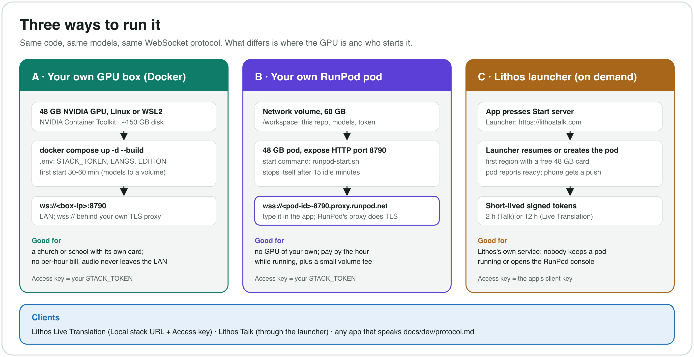

# User guide

How to install, run, connect, configure and check the Translation Open Stack, task
by task. Every variable, `languages.toml` key, command and pin is listed in
the [reference](reference.md); licences are in [licences.md](licences.md).

**Tasks**

- [Before you start](#before-you-start)
- [Install on your own GPU (Docker)](#install-on-your-own-gpu-docker)
- [Run on your own RunPod pod](#run-on-your-own-runpod-pod)
- [Connect apps](#connect-apps)
- [Choose the edition](#choose-the-edition)
- [Pick languages](#pick-languages)
- [Swap a voice](#swap-a-voice)
- [Route a language to another recogniser or translator](#route-a-language-to-another-recogniser-or-translator)
- [Replace a model or a revision](#replace-a-model-or-a-revision)
- [GPUs and capacity](#gpus-and-capacity)
- [Hardware profiles: other GPUs, two GPUs, AMD, Mac](#hardware-profiles-other-gpus-two-gpus-amd-mac)
  - [Create a profile](#create-a-profile)
- [Verify with the smoke test](#verify-with-the-smoke-test)
- [Update](#update)
- [Troubleshooting](#troubleshooting)



## Before you start

| | |
|---|---|
| GPU | **NVIDIA, 48 GB** (RTX 6000 Ada, RTX PRO 5000/6000, L40, L40S, A6000) for all 25 languages: the stack holds ~33 GB before anyone speaks. **32 GB** (RTX 5090, RTX PRO 4500) works with `MADLAD=3b` or without VoxCPM2; see [Fitting a 32 GB card](#fitting-a-32-gb-card). Smaller cards aren't supported. |
| OS | Linux with the NVIDIA driver (570 or newer, for CUDA 12.8), or Windows 11 with **WSL2** and the NVIDIA driver for WSL. **Macs can't run it** (no NVIDIA GPU; Apple GPUs don't run these models' CUDA code). |
| Software | Docker Engine with the Compose plugin (or Docker Desktop on Windows) and the **NVIDIA Container Toolkit**. |
| Disk | ~23 GB for the image, **~38 GB** for the models (kept), and ~48 GB more *during the first start only*, while the translators are built. ~150 GB free is comfortable. |
| CPU / RAM | 8+ cores (Piper voices run on the CPU), 32 GB+ RAM. |
| Network | Internet for the first start (downloads ~60 GB). After that, only your apps need to reach it. |

No GPU of your own? Rent one by the hour: [Run on your own RunPod pod](#run-on-your-own-runpod-pod).

**The token is the only lock.** The stack has no user accounts. Anyone with
the token can use it, within the connection limits. Both start paths refuse to
run without `STACK_TOKEN` (or `STACK_SIGNING_KEY`, for short-lived tokens from
a launcher); Docker also accepts `STACK_OPEN=1`, which is only for a private
network where you trust every device. Never forward port 8790 from the
internet without a token, and put the stack behind TLS (a reverse proxy or a
tunnel; RunPod's proxy does this for you) so the token isn't sent in clear
text. More: [reference, "Access, rooms and limits"](reference.md#access-rooms-and-limits).

## Install on your own GPU (Docker)

> **Status (2026-09-29):** the image (`Dockerfile`) builds and passes a CPU
> smoke test in CI, and its exact install steps and entrypoint served all voice
> engines, both translators and Omnilingual on an L40 (2026-09-28).
> `docker compose up` itself has not yet been run on a physical GPU machine:
> treat the first one as a test and report what breaks. The image is not
> published to any registry: build it with Compose.

1. **Check the GPU is visible to containers:**

   ```bash
   docker run --rm --gpus all nvidia/cuda:12.8.1-base-ubuntu24.04 nvidia-smi
   ```

2. **Get the code and configure it:**

   ```bash
   git clone https://github.com/lithsec/translation-open-stack.git
   cd translation-open-stack
   cp .env.example .env
   ```

   In `.env`, set `STACK_TOKEN` to a long random string (`openssl rand -hex 32`),
   and `LANGS` / `SRCS` / `EDITION` if you want fewer languages or the
   commercial edition. Every other variable in the
   [reference](reference.md#environment-variables) works in `.env` too.

3. **Build and start:**

   ```bash
   docker compose up -d --build
   docker compose logs -f
   ```

   Building the image takes about 10 minutes on a fast connection. The **first
   start then takes 30-60 minutes**: it downloads the Piper voices, builds the
   two translators from pinned upstream releases (Hy-MT2 7B quantised to 4
   bits, MADLAD-400 7B converted to CTranslate2), and fetches VoxCPM2 and the
   recognition models, all into the `lithos-models` volume. It is ready when
   the log shows:

   ```
   [stack] ready on :8790 for ['en', 'es', ...]
   ```

   Every later start skips what's on the volume and takes a few minutes.

4. **Check it from another machine:**

   ```bash
   curl http://<gpu-box>:8790/health        # "ok" once ready; no token needed
   ```

5. **Connect your apps**: [Connect apps](#connect-apps). On your LAN the URL is
   `ws://<gpu-box-ip>:8790`; from outside, `wss://…` behind your TLS proxy.

Compose runs two services. `volume-init` runs once as root and hands the model
volume to the image's unprivileged user `stack` (uid 10001): a fresh volume
needs nothing, and one filled by an older root container has its files
re-owned once. The `stack` service then runs as uid 10001, never root. It
mounts `languages.toml` read-only, so you edit it on the host (see
[Pick languages](#pick-languages)). Compose reserves one GPU; to give the stack
two (see [GPUs and capacity](#gpus-and-capacity)), change `count: 1` to
`count: all` in `docker-compose.yml`.

`docker compose down -v` deletes the model volume: the next start downloads
and builds everything again.

## Run on your own RunPod pod

[RunPod](https://www.runpod.io) rents GPUs by the hour: a 48 GB card (L40,
L40S, RTX 6000 Ada, A6000, RTX PRO 5000); check RunPod for current prices. You pay
only while a pod runs. The models live on a **network volume** that outlives
the pods, so after the first start a pod is serving in about 5-8 minutes.
Everything here is in RunPod's web console; nothing depends on Lithos servers.

### One click: the RunPod template

The quickest way (tested 2026-09-30 on an RTX A6000: first start to ready in
14 minutes, smoke test all passed). The template runs the published image
`ghcr.io/lithsec/translation-open-stack` (every package installed; no model
weights, which download on first start; the GPL programs inside ship with their
licence and source in `/opt/stack/licences`).

1. Open the template: **[Deploy on RunPod](https://console.runpod.io/deploy?template=dftcc24b6q)**.
2. Pick a **48 GB GPU** (see [GPUs and capacity](#gpus-and-capacity)).
   Optional, under **Edit template**: `EDITION` (`nonprofit` or `commercial`),
   `STACK_IDLE_MIN`, and new variables such as `LANGS` / `SRCS` or your own
   `STACK_TOKEN`. The pod's own 60 GB volume holds the models. Optional: attach a **network volume** of
   60 GB+ instead of the pod's own volume, so the models outlive the pod and
   any new pod in that data center starts in minutes.
3. **Deploy.** Open the pod's **Logs**. Near the top:

   ```
   == connect: wss://<pod-id>-8790.proxy.runpod.net
   == access key: <64 hex characters>
   ```

   With no `STACK_TOKEN` set, the pod makes a random one, saves it in
   `/workspace/.stack-token` and prints it once; later,
   `cat /workspace/.stack-token` in the pod's terminal shows it again.
4. **Wait** 30-60 minutes the first time (~60 GB of downloads and the
   translator build), a few minutes after that. It is ready at
   `[stack] ready on :8790`.
5. Put the URL and the access key in your app ([Connect apps](#connect-apps)).

The pod stops itself when idle, as in step 7 below. The rest of this section
is the same setup by hand, on the stock image.

### By hand

1. **Create a network volume**, 60 GB, in a data center that has 48 GB GPUs
   (Storage -> Network Volumes; billed monthly by size). The models take ~38 GB. A
   volume can only be attached when a pod is created, and only to a pod in its
   own data center.
2. **Put the repository on it.** Deploy any cheap pod with the volume attached
   (a CPU pod if that data center offers them), open its web terminal and run:

   ```bash
   git clone https://github.com/lithsec/translation-open-stack.git /workspace/translation-open-stack
   ```

   (Or copy a clone from your machine with
   `scp -P <port> -r translation-open-stack root@<pod-ip>:/workspace/translation-open-stack`.)
   `/workspace/translation-open-stack` is the conventional folder: the start
   command below uses it. Terminate that pod.
3. **Make a token.** A pod gets a public HTTPS address, so the stack refuses
   to start without a credential. Make a long random string
   (`openssl rand -hex 32`) and either set it as the pod's environment
   variable `STACK_TOKEN` (step 4), or write it to the volume once: in a pod's
   terminal, `cat > /workspace/.stack-token`, paste, Enter, Ctrl-D, then
   `chmod 600 /workspace/.stack-token`. Keep it somewhere safe.
4. **Deploy the stack pod** with the volume attached:
   - GPU: 48 GB (see [Fitting a 32 GB card](#fitting-a-32-gb-card) for less)
   - Image: `runpod/pytorch:1.0.2-cu1281-torch280-ubuntu2404` (or your own
     build of this repository's `Dockerfile`, which skips the ~3 minutes of
     package installs on every boot)
   - Container disk: **80 GB** (the first start builds the translators there)
   - Volume mount path: `/workspace`
   - Expose ports: **HTTP `8790`** (this is what gives the pod its public
     `https://<pod-id>-8790.proxy.runpod.net` address), TCP `22`
   - Start command:
     `bash -c 'bash /workspace/translation-open-stack/scripts/runpod/runpod-start.sh > /workspace/stack.log 2>&1 & exec /start.sh'`
   - Environment (optional): `STACK_TOKEN`; `LANGS` / `SRCS` / `EDITION` /
     `MADLAD` and the rest of the [reference](reference.md#environment-variables).
5. **Wait for it.** The first start downloads ~60 GB and builds the
   translators: 30-60 minutes. Later starts: ~3 minutes of package installs on
   the stock image, then 2-5 minutes loading models. In the pod's terminal,
   `tail -f /workspace/stack.log` shows progress; it is ready at
   `[stack] ready on :8790`, and `curl localhost:8790/health` answers 200.
6. **Type the URL into your app.** The address is

   ```
   wss://<pod-id>-8790.proxy.runpod.net
   ```

   - **The pod ID** is the short code on the pod's card in the RunPod console
     (Pods list), also in its URL. The pod's **Connect** panel lists the HTTP
     service on port 8790 as `https://<pod-id>-8790.proxy.runpod.net`; use the
     same host with `wss://`. RunPod's HTTP proxy passes WebSockets through and
     provides the TLS, so there is nothing else to set up.
   - **The token** goes in the app's **Access key** field (it is sent as
     `Authorization: Bearer <token>`), not in the URL.
   - Check it first: `curl https://<pod-id>-8790.proxy.runpod.net/health`
     answers `ok` once the models are loaded (no token needed for `/health`).
   - Then [Connect apps](#connect-apps).
7. **Stopping.** With no one connected for 15 minutes (`STACK_IDLE_MIN`,
   counted from ready) or after 8 hours regardless (`STACK_MAX_UPTIME_H`), the
   pod stops itself through RunPod's API (`scripts/idle-stop.sh`, with the
   pod's own scoped key from its environment). Compute billing stops; the
   volume keeps the models. **Start** it again from the console before the next
   service. A stopped pod can fail to start if its host's GPU has been rented
   out meanwhile ("not enough free GPUs"): terminate it and deploy a new one
   with the same settings (step 4). Nothing is lost; the volume has everything.

**The ready report.** A pod can POST "ready" or "failed" to a URL once the
models are loaded, so whoever started it gets a notification. It does so only
when `STACK_REPORT_URL` (or the file `/workspace/.stack-report-url`) names a
URL and a `STACK_SIGNING_KEY` is set; there is no default, and unset means no
report and nothing leaves the pod. The report is signed with audience
`report`, which the stack refuses as a connection credential.

**Why the pod runs as root.** RunPod's start command replaces the image's
command and must `exec /start.sh`, whose SSH server needs root, and RunPod
mounts the network volume at `/workspace` owned by root. The Docker path runs
as uid 10001; the RunPod path stays root.

### The Lithos launcher

The Lithos apps can also use Lithos's hosted launcher at `lithostalk.com`,
which starts a pod on demand when a service needs one and gives the app a
short-lived signed token instead of a long-lived one; nobody keeps a pod
running or opens the RunPod console. It runs this same repository with the
start command above. To run your own launcher, you would issue tokens signed
with the pods' `STACK_SIGNING_KEY` ([reference](reference.md#signed-tokens))
and start pods with your own RunPod key.

## Connect apps

**Lithos Live Translation**: Operator page -> **Settings -> Advanced provider
settings -> Local stack setup**:

- **Local stack URL**: `ws://<gpu-box-ip>:8790` on your LAN, `wss://…` behind
  TLS, or `wss://<pod-id>-8790.proxy.runpod.net` on RunPod.
- **Access key**: your `STACK_TOKEN`. The app sends it as an
  `Authorization: Bearer` header.
- **Launcher**: leave it empty for your own stack. With the Lithos launcher
  instead, set it to `https://lithostalk.com` and use the access key Lithos
  gave you; then **Start server** (or just go live: it starts itself).
- Press **Test**: it should report the server's hello. Then, under
  **Languages**, set each language's provider to **Local stack**.

**Lithos Talk** reaches the stack through the Lithos launcher; there is
nothing to configure in the app.

**Any other client**: open one WebSocket per listening language, send PCM16
audio, receive JSON captions and PCM16 speech. The whole contract, with a
minimal Python client: [the protocol](dev/protocol.md).

```
wss://HOST/translate?lang=es&src=auto&room=main      Authorization: Bearer <token>
```

To try a stack from a terminal, `tools/client.py` streams a WAV file (24 kHz
mono) and saves what comes back:

```bash
STACK_TOKEN=... python3 tools/client.py --url wss://<pod-id>-8790.proxy.runpod.net --lang es --wav talk.wav
```

## Choose the edition

`EDITION` decides which voices may load. Recognition and translation are the
same in both; only the voices differ.

| | `EDITION=nonprofit` (default) | `EDITION=commercial` |
|---|---|---|
| What may load | everything configured | only voices and models licensed for commercial use ([`server/licences.py`](../server/licences.py)); unclear (❓) ones after your own review |
| Haitian Creole | MMS (clearest tested: 10% vs 21% recognition error) | Coqui VITS OpenBible (CC-BY-SA) |
| Khmer, Lao, Tagalog | VoxCPM2, else MMS | VoxCPM2 (waits up to 15 s for a free instance), else text only |
| Korean, Turkish, Russian, Arabic, Indonesian, Swahili, Vietnamese | Piper | VoxCPM2 (GPU); eSpeak NG when every instance is busy past 2 s or VoxCPM2 is not running |
| German; en/es/fr fallbacks | Piper `thorsten`; `lessac`, `davefx`, `siwis` | Piper `mls`; `norman`, `carlfm`, `mls` |
| Persian, Romanian | Piper | **eSpeak NG only** (robotic; no commercially licensed voice) |
| Non-commercial weights loaded | yes (MMS, several Piper voices) | none |
| VoxCPM2 instances | one | one per GPU with room ([GPUs and capacity](#gpus-and-capacity)) |

Set it in `.env` or the pod's environment (`EDITION=commercial`). Before you
start, see what your `languages.toml` would get:

```bash
python3 server/stack_config.py check --edition commercial
```

`scripts/run.sh` prints the same at every start. For each language it shows
the recogniser, the translator and the voice chain, each with its licence
class (✅ permissive, ⚠️ attribution or share-alike, ❓ unclear, ⛔
non-commercial), and under it what was **not loaded** and why, with the exact
`[licence_review]` line that would admit a ❓ item. Then the `[models]`
entries with their licences, what VoxCPM2 serves and how many instances it
will run, and a summary: which languages are **text only**, which are
**eSpeak NG only**, and the **credits you must show** (for example on an About
screen). It exits non-zero when a `[models]` entry may not load in that
edition, and the server refuses to start on it too.

What the commercial edition guarantees and what stays yours, and the checklist
before commercial use: [licences.md §2](licences.md#2-editions-what-edition-changes)
and [§10](licences.md#10-before-you-deploy-commercially).

## Pick languages

`LANGS` are the languages people **listen** in, `SRCS` the languages people
may **speak** (the stack detects which one, per sentence). Both default to all
25:

| | |
|---|---|
| en English, es Spanish, fr French, pt Portuguese, it Italian, de German | ru Russian, uk Ukrainian, zh Mandarin, ja Japanese, ko Korean, vi Vietnamese |
| ar Arabic, fa Persian, hi Hindi, bn Bengali, ur Urdu, id Indonesian | tr Turkish, tl Tagalog, sw Swahili, km Khmer, lo Lao, ht Haitian Creole |
| ro Romanian | |

```bash
# .env, or the pod's environment
LANGS=en,es,fr,ko
SRCS=en,es
```

Fewer languages start faster and use less CPU, but save little GPU memory: the
big models are shared and load whatever the language list. What frees GPU
memory is `VOXCPM=0` (~7 GB; Khmer, Lao and Tagalog then fall back) and the
smaller translator, `MADLAD=3b` (~5 GB). Which engine serves each language:
[licences.md §3](licences.md#3-every-language-per-edition), or
`python3 server/stack_config.py check`.

### Add a language

`languages.toml` (at the repository root) says which model serves each
language. A new language is one section with at least a voice, and
`madlad = "<code>"` if MADLAD's tag differs from the code (Tagalog is `fil`).
Hy-MT2 translates into the 36 languages in `stack_config.HYMT_LANGS`; for any
other, set `translator = "madlad"`.

```toml
# Polish: Piper voice, Hy-MT2 translation, Whisper recognition
[pl]
piper = "pl_PL-gosia-medium"
asr = "whisper"
translator = "hymt"
madlad = "pl"
```

Then:

1. Lock the new Piper voice (the stack downloads only voices in `voices.lock`,
   checked by sha256):

   ```bash
   python3 scripts/lock-voices.py pl_PL-gosia-medium
   ```

2. Add `pl` to `LANGS` (and `SRCS`, if people will speak it).
3. Check and restart:

   ```bash
   python3 server/stack_config.py check       # validates the file (Python 3.11+; also run at every start)
   docker compose up -d --force-recreate      # Docker: picks up the edited file and .env
   ```

   On RunPod, edit `/workspace/translation-open-stack/languages.toml` and restart
   the pod. `scripts/fetch-voices.sh` downloads the voice on the next start.

For `EDITION=commercial`, a voice with no entry in `server/licences.py` is ❓
(unclear) and is left out until you add its licence there (the tests then
check it) or record your own review in `[licence_review]`
([Swap a voice](#swap-a-voice)).
[licences.md §7](licences.md#7-piper-voices-one-by-one) lists every voice
already checked.

## Swap a voice

A language's voice is a **fallback chain**, tried in this order: Kokoro,
VoxCPM2, Coqui, Piper, MMS, then eSpeak NG as the last resort. The first one
that is running and succeeds speaks. `voice = ["piper", "kokoro"]` sets another
order. A `[<lang>]` section **replaces** that language's defaults entirely, so
keep every key you still want.

```toml
# German in a different Piper voice
[de]
piper = "de_DE-mls-medium"
asr = "whisper"
translator = "hymt"
madlad = "de"
```

Then lock the voice and restart, as in [Add a language](#add-a-language).

**Choosing a Piper voice.** The catalogue, with every voice and quality tier:
`https://huggingface.co/rhasspy/piper-voices/resolve/main/voices.json`.
Tiers are `x_low`, `low`, `medium`, `high`. **Not every language has every
tier**: as of writing, English, Spanish, Italian, Ukrainian, German and Polish
have `high`; French, Portuguese, Chinese, Vietnamese, Korean and Japanese top
out at `medium`; Swahili has exactly one voice. Higher tiers are larger and
slower, but Piper runs at roughly 20x real time, so a tier upgrade is usually
affordable. Listen before deciding: quality differences between speakers
within a tier are often larger than between tiers. **Accent is a real
choice**: Spanish has no `es_ES` voice at `high` (the high voices are Mexican
and Argentine), and a congregation will notice which one you pick. Check the
voice's licence ([licences.md §7](licences.md#7-piper-voices-one-by-one))
before a commercial deployment.

**Kokoro** voices are the `kokoro = "<lang_code>:<voice>"` entries
(catalogue: `hexgrad/Kokoro-82M` on Hugging Face), for the languages Kokoro
speaks (en es fr it pt ja zh hi).

**VoxCPM2** speaks each of its languages in a fixed reference voice,
`voices/voxcpm/<lang>.wav` ([how they were chosen](../voices/voxcpm/README.md)).
To change one, replace the file and delete its copy in
`/workspace/voices/voxcpm/` so the next start copies it (the copy on the volume
is never overwritten). To give a language to VoxCPM2, set `voxcpm = true` in
its section (or `[<lang>.commercial]`); VoxCPM2's languages are listed in
[licences.md §11.2](licences.md#112-candidates).

**The commercial edition's voices** are in `[<lang>.commercial]`: the voice
keys (and `voice`) to use instead when `EDITION=commercial`; `asr`,
`translator` and `madlad` still come from `[<lang>]`.

```toml
[ko.commercial]
voxcpm = true
```

A ❓ (unclear) voice loads in commercial only after you have reviewed its
licence yourself and recorded it:

```toml
[licence_review]
"ro_RO-mihai-medium" = "reviewed 2026-10-01 by Example Org: CC0 data; we accept the lessac fine-tune"
```

There is no override for ⛔ (non-commercial) items.

## Route a language to another recogniser or translator

In a language's section:

- `asr = "whisper"` or `asr = "omni:<code>"` picks the recogniser used when
  that language is **spoken**. Omnilingual takes Meta's language codes
  (`omni:khm_Khmr`, `omni:hat_Latn`); it serves fa bn ur hi sw ht km lo by
  default because Whisper is weak there.
- `translator = "hymt"` or `translator = "madlad"` picks the translator
  **into** that language. Hy-MT2 only covers its 36 languages; a source
  language it doesn't know reaches the others through MADLAD via English.

For no Tencent model at all, set `translator = "madlad"` for every language
and don't build Hy-MT2 (or delete `/workspace/mt/hymt2-7b-nf4`, so
`scripts/run.sh` doesn't load it). MADLAD 7B scored 87% against Hy-MT2's 95%
in the [evaluation](dev/model-evaluation.md).

`python3 server/stack_config.py check` validates the names; an unknown one is
an error, not a silent fallback. A new *kind* of recogniser, translator or
voice is an engine: one Python file, named here the same way
([adding-an-engine.md](dev/adding-an-engine.md)).

## Replace a model or a revision

The models every language shares are pinned in `languages.toml` under
`[models]`: Whisper, Omnilingual, language ID, Silero VAD, Hy-MT2, MADLAD 7B
and 3B, Kokoro and VoxCPM2, each with its repository and exact revision. A
`[models.<name>]` table is **merged key by key** over the default (unlike a
language table), so give only what you change:

```toml
[models.whisper]
model = "large-v3-turbo"
revision = ""        # the old revision belongs to large-v3's repo; "" = unpinned
```

A Whisper `revision` belongs to `model`'s repository: change both together.
If you set `multi_model` (a second model for non-English sources), pin it
with `multi_revision`. A revision of `""` means unpinned (whatever the
repository serves now); the translators and VoxCPM2 must have one, because
their builds are stamped with it. Every key:
[reference, "[models.<name>]"](reference.md#modelsname).

Check, restart, then [verify](#verify-with-the-smoke-test):

```bash
python3 server/stack_config.py check
python3 server/stack_config.py get models.hymt.revision   # one value, as the scripts read it
```

In `EDITION=commercial` a changed model must still be classified as allowed in
`server/licences.py`: another Hy-MT2 revision is ❓ until someone reads its
licence, and the server will not start on it.

### What must be rebuilt

The translators are the only models converted on the volume:

| Build | Directory | Built from |
|---|---|---|
| Hy-MT2 7B, 4-bit NF4 | `/workspace/mt/hymt2-7b-nf4` | `[models.hymt]` |
| MADLAD 7B, CTranslate2 int8 | `/workspace/mt/madlad7b-ct2` | `[models.madlad]` |
| MADLAD 3B, CTranslate2 int8 (`MADLAD=3b`) | `/workspace/madlad-ct2` | `[models.madlad3b]` |

Each build writes `PROVENANCE.txt`, whose first line is `<repo> @ <revision>`.
`scripts/prepare-mt.sh` compares it with `languages.toml`: when they differ it
rebuilds into `<dir>.tmp` and swaps it in only when the build has finished, so
the old build keeps serving until then (and a failed build leaves it in
place). `scripts/runpod/runpod-start.sh` and the Docker entrypoint run
`prepare-mt.sh` before every start, so on those paths a new revision is picked
up by restarting; `scripts/run.sh` on its own only warns
(`WARNING: ... was built from ...`). A build with no `PROVENANCE.txt` (MADLAD 3B
converted by older provisioners) is kept as it is; delete the directory to
rebuild it at the pinned revision. A rebuild needs the same as the first
build: a GPU and ~45 GB of scratch (`MT_SCRATCH`).

Everything else (Whisper, language ID, Silero, Omnilingual, Kokoro, VoxCPM2)
is fetched into the caches on the volume by revision on the next start, so an
old revision stays cached beside the new one and switching back costs nothing.
`VOXCPM_REV` in the environment wins over `[models.voxcpm]`.

## GPUs and capacity

**What one GPU holds.** With all 25 languages the stack holds **about 33 GB
at idle**: 25.7 GB for the server and 7.1 GB for the VoxCPM2 voice service
(measured 2026-09-28 on an L40 with `expandable_segments`; the server measured
26.0 GB with Romanian on an RTX 6000 Ada; the commercial stack, VoxCPM2
included, 33.6 GB). The languages themselves cost little GPU memory (most
voices run on the CPU); the large models are fixed. A 48 GB card leaves room
for activations under load.

**VoxCPM2 is the part that runs out.** It makes one voice at a time: one
instance keeps about two to three listeners in real time (RTF 0.28 on an A100,
0.46 on an RTX PRO 4500). The non-profit edition routes only Khmer, Lao and
Tagalog to it; the commercial edition routes ten languages (ko tr ru ar id sw
vi km lo tl). Each connection's audio is made separately: two connections
listening in Korean are two voices.

| | Setting | Default |
|---|---|---|
| How many instances | `VOXCPM_INSTANCES`: `auto` = one on the main GPU plus one on each other GPU with at least 10 GB, up to `VOXCPM_MAX_INSTANCES` (4); a number; or `0` = none | `auto` in commercial, `1` in nonprofit |
| Exactly which GPUs | `VOXCPM_GPUS=0,1,1` (here two instances share GPU 1) | unset |
| Sentences one instance takes at once | `VOXCPM_MAX_INFLIGHT`; a service makes one voice at a time, so more only hides a queue | `1` |
| Wait for a free instance, then the next voice (eSpeak NG) | `VOXCPM_QUEUE_S` | 2 s |
| Wait for a language with no voice after VoxCPM2 (km lo tl in commercial), then text only | `VOXCPM_WAIT_S` | 15 s |

When every instance is busy, the server queues a sentence for the first free
instance on any GPU. After 2 s it is spoken by eSpeak NG instead, so a busy
room hears some sentences in the robotic voice rather than audio falling
behind the captions. Watch the `VoxCPM2 busy` and `VoxCPM2 stats` lines in the
log under load. `python3 server/stack_config.py voxcpm-plan --edition
commercial` prints where the instances would run on this machine.

**One GPU or two.** On one GPU everything shares the card, with one VoxCPM2
instance. With a second GPU (10 GB or more), the commercial edition starts a
second instance there automatically, doubling VoxCPM2's capacity; or put the
only instance on the second card (`VOXCPM_GPUS=1`) to free ~7 GB on the first.
Under Docker, give the container both GPUs first (`count: all` in
`docker-compose.yml`). Other options: accept overflow for rooms that rarely mix
many VoxCPM2 languages, or serve some of them as eSpeak NG or text (drop
`voxcpm = true` from their `[<lang>.commercial]`).

`ESPEAK=0` turns the last-resort voice off: overflow is then silent, and fa
and ro are text only in commercial.

### Fitting a 32 GB card

The ~33 GB idle footprint is past a 32 GB card (RTX PRO 4500, RTX 5090) before
anyone speaks. `STACK_PROFILE=cuda-32gb` makes the usual choice (`MADLAD=3b`)
for you. The options:

| Option | Saves | Costs |
|---|---|---|
| `MADLAD=3b` (the smaller fallback translator) | ~5 GB | Swahili, Haitian Creole, Lao and Romanian, the languages only MADLAD translates, get worse (MADLAD 3B scored 82% overall against 87% for 7B), and so does translating Haitian Creole or Romanian speech, which goes through MADLAD to English first. Swahili is already the weakest language (69% into Swahili). |
| VoxCPM2 on another GPU (`VOXCPM_GPUS`, or the server's `--voxcpm http://<other-host>:8791`) | 7.1 GB | No quality loss, but a second card. |
| `VOXCPM=0` | ~7 GB | Khmer, Lao and Tagalog speak through MMS in the non-profit edition, or are text only in commercial, where Korean, Turkish, Russian, Arabic, Indonesian, Swahili and Vietnamese fall to eSpeak NG. |
| Drop languages | little | Piper and Kokoro voices are CPU or shared; only removing VoxCPM2 or Omnilingual languages frees GPU memory. |

With `MADLAD=3b` the start builds MADLAD 3B into `/workspace/madlad-ct2`
(`prepare-mt.sh` honours `MADLAD`). A 32 GB card usually costs somewhat less
per hour than a 48 GB card of the same generation; check RunPod's current
prices. Measurements behind these numbers:
[model-evaluation.md §5](dev/model-evaluation.md#5-fitting-on-a-24-gb-card).

## Hardware profiles: other GPUs, two GPUs, AMD, Mac

The languages and the edition say *what* is served; a **profile** says *on
what*. One variable picks it, and it can move each model to a chosen card,
swap a model for a smaller one, set the scripts' defaults, and reroute a
language whose recogniser can't run on that hardware:

```bash
python3 server/stack_config.py profiles             # what ships
python3 server/stack_config.py profile cuda-2gpu    # exactly what it changes
STACK_PROFILE=cuda-2gpu                             # in .env, or the pod's environment
```

| Profile | Hardware | Status |
|---|---|---|
| `cuda-48gb` | one 48 GB NVIDIA GPU | the reference; same as no profile |
| `cuda-32gb` | one 32 GB NVIDIA GPU | `MADLAD=3b` ([above](#fitting-a-32-gb-card)) |
| `cuda-2gpu` | two NVIDIA GPUs, 24 GB+ each | translators on GPU 0, recognition and voices on GPU 1 |
| `radeon-32+16` | AMD R9700 32 GB + RX 9060 XT 16 GB | **preview, not yet run**; needs a ROCm build (below) |

### Create a profile

A profile is one small TOML file. Every table in it is optional; leave out
what you don't change.

1. **Start from the closest one.** Profiles live in `profiles/` (Docker mounts
   that folder, so a new file there is seen without a rebuild):

   ```bash
   cp profiles/cuda-2gpu.toml profiles/my-box.toml
   ```

   The name is the file name without `.toml`: letters, digits and `. _ + -`.
   `STACK_PROFILE` also takes a path, for a profile kept elsewhere.

2. **Edit it.** A complete example, for two cards where the second is small:

   ```toml
   # One line, shown by `stack_config.py profiles`.
   description = "RTX 4090 24 GB + RTX 4060 Ti 16 GB"

   # Defaults for the start scripts' variables. A value already set in the
   # environment (.env, the pod's variables) wins over these.
   [env]
   VOXCPM_GPUS = "0"          # the VoxCPM2 voice service on the big card
   MADLAD = "3b"              # the smaller fallback translator

   # Which card each model loads on. "default" is everything not listed.
   # Values: auto, cpu, cuda, cuda:<n>, mps. AMD cards are cuda:<n> too.
   [devices]
   default = "cuda:0"
   whisper = "cuda:1"
   omni = "cuda:1"
   kokoro = "cuda:1"
   lid = "cpu"

   # A different model, only while this profile is in use (merged key by key
   # over languages.toml's [models]).
   [models.whisper]
   model = "large-v3-turbo"
   revision = ""              # or the commit you tested; "" = unpinned

   # Language routes for this hardware (merged key by key over the language's
   # table), e.g. Khmer through Whisper where Omnilingual can't run.
   [languages.km]
   asr = "whisper"
   ```

   The keys `[devices]` accepts: `default`, `lid` (language ID) and every
   engine name (`python3 server/stack_config.py engines` lists them). The
   `[models.<name>]` keys are in the
   [reference](reference.md#modelsname), the language keys in
   [Route a language](#route-a-language-to-another-recogniser-or-translator).

3. **Check it** before starting anything. Both commands stop with a message
   naming the mistake (an unknown engine, a device like `gpu1`, a typo in a
   table name):

   ```bash
   python3 server/stack_config.py profile my-box   # exactly what it changes
   STACK_PROFILE=my-box python3 server/stack_config.py check
   ```

4. **Use it:** `STACK_PROFILE=my-box` in `.env` (Docker) or the pod's
   environment (RunPod), then restart. The start log begins with
   `profile: my-box`, and `[stack] device=cuda:0, whisper=cuda:1, ...`.

5. **Measure, then adjust.** While loading, the log prints each model's share
   of its card:

   ```
   [stack] whisper on cuda:1: +3.3 GB (3.6 GB in use there)
   [stack] hymt on cuda:0: +5.6 GB (12.0 GB in use there)
   ```

   Keep a few GB free on each card for activations under load, then run the
   [smoke test](#verify-with-the-smoke-test). To try a change without editing
   the file, `STACK_DEVICES=kokoro=cuda:0` wins over the profile for that
   start. A card that isn't there (`cuda:2` on a two-GPU machine) stops the
   start with a message.

A model that isn't a PyTorch or CTranslate2 model the stack already runs
needs an engine, not a profile: [adding-an-engine.md](dev/adding-an-engine.md).
The full format: [reference, "Profiles and devices"](reference.md#profiles-and-devices).

### AMD and Mac

**AMD (ROCm), today.** Nothing in this repository installs a ROCm build yet,
so it takes work by hand, on Linux with ROCm 7.2 or later:

- PyTorch for ROCm, in place of the CUDA build.
- CTranslate2's ROCm wheel (Whisper and MADLAD) from its
  [GitHub releases](https://github.com/OpenNMT/CTranslate2/releases)
  (`rocm-python-wheels-Linux.zip`); it is built for RDNA 2-4 cards including
  the R9700 (gfx1201) and RX 9060 XT (gfx1200), not for Instinct cards.
- Hy-MT2's 4-bit build needs bitsandbytes with ROCm support for your card;
  untested.
- Omnilingual (fairseq2) publishes no ROCm packages: route its languages to
  Whisper in the profile (`[languages.km] asr = "whisper"`, and so on), at
  lower quality for them.
- Then `STACK_PROFILE=radeon-32+16`. Please report what worked.

**Mac.** Not yet: Docker on a Mac cannot reach the GPU, and CTranslate2 and
Omnilingual have no Apple GPU support. A native Apple Silicon setup (Whisper
and Hy-MT2 through MLX, fewer languages) is planned.

## Verify with the smoke test

After any model, voice or dependency change, run the end-to-end smoke test
against the running stack on its GPU. It covers every voice engine, both
translators, Omnilingual, concurrent connections, the Lithos Talk pair
(`route=to`) and auth, prints a table and must end with `ALL PASSED`:

```bash
ssh -L 8790:127.0.0.1:8790 root@<pod-ip> -p <ssh-port>   # RunPod: tunnel the port first
STACK_TOKEN=... python3 tools/smoke.py                   # --quick, --langs es,km
STACK_TOKEN=... python3 tools/smoke.py --edition commercial
```

`--url` points it at another address (default `ws://127.0.0.1:8790`), and
`--token` passes the token instead of `$STACK_TOKEN`. `--load N` runs a
capacity test instead: N simultaneous connections into the VoxCPM2 languages
(`--load-langs`), failing any whose first audio comes more than 4 s after the
clip.

The CPU protocol tests (`tests/test_protocol.py`) check the plumbing, not the
models; they are no substitute. Quality changes need the evaluation
([model-evaluation.md](dev/model-evaluation.md)): the smoke test only proves
each path produces sensible speech.

## Update

**Docker:** `git pull && docker compose up -d --build`. The volume is kept, so
nothing is downloaded again unless a model changed.

**RunPod:** `git -C /workspace/translation-open-stack pull` from a pod's terminal
(or copy a new clone over it) and restart the pod. Replace every file together;
the scripts depend on each other. A copy made before the September 2026
reorganisation has the scripts at the repository root; the current ones are in
`scripts/`, `scripts/runpod/` and `server/`, and the old root copies can go.

After updating, the next start re-checks every Piper voice against
`voices.lock` and rebuilds a translator whose pinned revision changed. Run the
[smoke test](#verify-with-the-smoke-test) if models or dependencies moved.

## Troubleshooting

- **`could not select device driver "nvidia"`** or **"No NVIDIA GPU visible"**:
  the NVIDIA Container Toolkit isn't installed or Docker wasn't restarted after
  installing it. The `nvidia-smi` check in
  [Install](#install-on-your-own-gpu-docker) must work first. On WSL2, install
  the Windows NVIDIA driver only (not a Linux driver inside WSL).
- **Refuses to start, asks for `STACK_TOKEN`**: set it in `.env` (next to
  `docker-compose.yml`), or `STACK_OPEN=1` on a private LAN. On RunPod: the
  pod's environment or `/workspace/.stack-token`.
- **First start stops with "No space left on device"**: the translator build
  needs ~48 GB of scratch on top of the models. Free space and
  `docker compose up -d` again: finished models are kept, the build resumes.
- **Start stops with "Piper voices failed verification against voices.lock"**:
  a voice is `not in voices.lock` (one you added: `python3
  scripts/lock-voices.py <voice>`), or a download's sha256 differs from the
  lock (`... voices.lock expects ... Refused.`): the upstream file changed, so
  review it before re-locking; see
  [reference, "Piper voices"](reference.md#piper-voices-voiceslock). A file
  already on the volume that doesn't match is simply fetched again.
- **CUDA out of memory at start or under load**: the card is too small for the
  configuration; see [Fitting a 32 GB card](#fitting-a-32-gb-card).
- **A language is text only / silent**: look for its line in the log
  (`docker compose logs stack | grep -i "<lang>"`). "no Piper voice mapped",
  "Piper voice unavailable" or a `FAILED` download means the voice in
  `languages.toml` is wrong or unreachable. In commercial, `check --edition
  commercial` says which languages are text only and why.
- **Khmer/Lao/Tagalog use a different voice each sentence**: the VoxCPM2
  reference voices are missing from `/workspace/voices/voxcpm/`. They ship in
  `voices/voxcpm/` and `scripts/prepare-voices.sh` copies them onto the volume;
  it never overwrites one already there.
- **Some sentences in a robotic voice**: VoxCPM2 was busy for more than 2 s and
  eSpeak NG spoke instead; see [GPUs and capacity](#gpus-and-capacity).
- **The app's Test fails**: `curl http://<box>:8790/health` from the app's
  machine. No answer: firewall or wrong address. `ok` but Test fails: check the
  token; the stack's log says `refused: bad or missing token` when it's wrong.
- **A client is disconnected with a code**: 4401 bad or missing token, 4429
  too many connections, 4408 session time limit, 4400 a query parameter the
  server doesn't accept (the preceding `error` message names it), 4413 audio
  faster than 2x real time, 1009 a message over 256 KB
  ([reference](reference.md#access-rooms-and-limits)).
- **Two apps with different tokens don't hear each other in `room=main`**: by
  design. A room belongs to one token subject.
- **Port 8790 already in use**: `scripts/run.sh` refuses to start beside a
  stale server (which would keep serving old code); stop the old one first.
- **Slow or robotic audio on phones**: usually the venue's WiFi, not the
  stack. On a real deployment a phone on 2.4 GHz while the host was on 5 GHz
  lost 16-39% of its packets, which a UDP (WebRTC) listener hears as robotic,
  stretched audio; putting both on 5 GHz fixed it completely. Loss above a few
  percent is a network problem that no pacing, buffering or codec setting
  fixes. How to diagnose it in a particular app (for example Lithos Live
  Translation's `?rtc=0` and `LITHOS_RTC_STATS=1`) is in that app's
  documentation.
- **Starting over**: `docker compose down -v` deletes the model volume (the
  next start downloads everything again).
